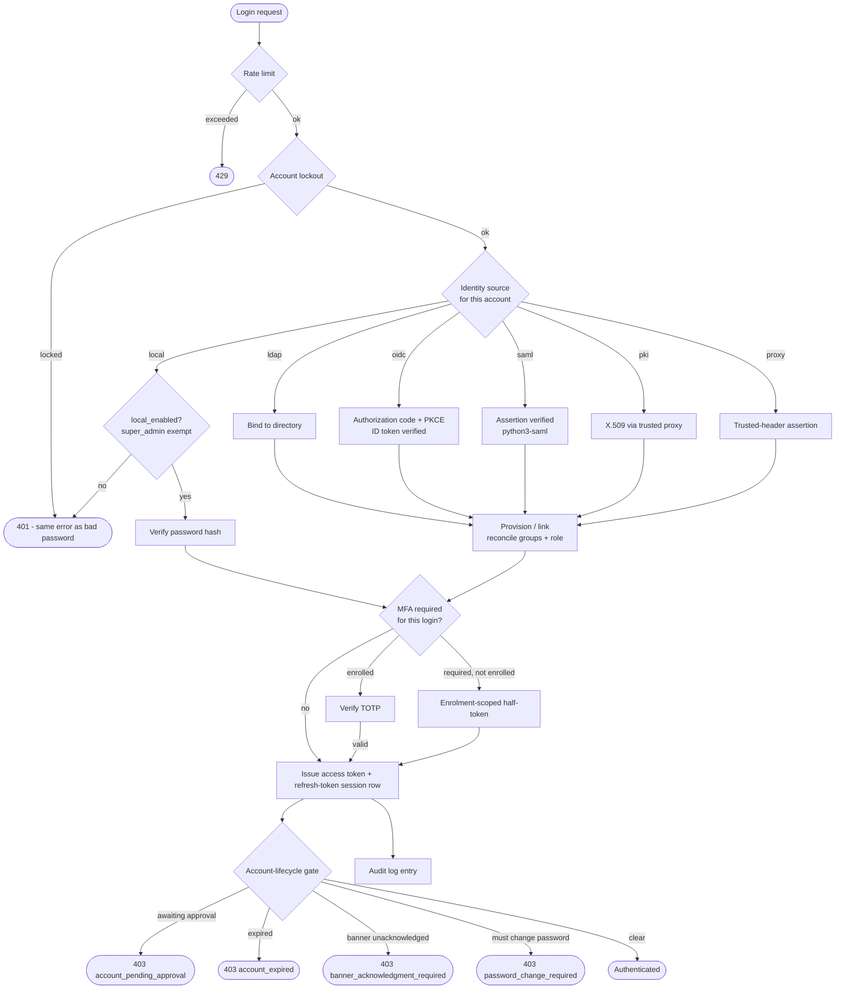

# Authentication & Security

OpenTranscribe's authentication system is built around one idea: **the deployment decides where
identity lives, and the product enforces that decision everywhere.** Six identity sources run
simultaneously, all configured from a single admin surface, all stored encrypted in the
database, all changeable without a restart.

This page is the tour. The setup guides live under
[Authentication](../authentication/overview).

## Authentication flow

The lifecycle gate runs on **every authenticated request**, not just at login, so a flag set
while a session is live takes effect immediately.

## Identity sources

### Local passwords
PostgreSQL-stored credentials with a full password policy. Accounts arrive by
self-registration (when enabled), by an admin invitation, or by admin creation.

### LDAP / Active Directory
Auto-provisioning on first login, group-based admission control, admin mapping, and a periodic
sweep that **deprovisions** accounts the directory has removed — disabling them *and* revoking
their sessions.

### OpenID Connect
Any conforming provider — Keycloak, Authentik, Authelia, Okta, Entra ID, Auth0, Zitadel —
discovered from its `.well-known/openid-configuration`. Authorization-code flow with PKCE,
ID-token-only validation, and RP-initiated logout using an ID token kept on the session row
rather than in a cookie.

### SAML 2.0
Service-provider role for IdPs that only speak SAML (ADFS, Shibboleth, Okta-classic). Assertion
parsing and signature verification are `python3-saml`'s, never hand-rolled; email-match account
linking is refused unconditionally because SAML has no standard "address verified" claim.

### PKI / X.509
Mutual TLS terminated at the reverse proxy, CAC/PIV common-name parsing, OCSP and CRL
revocation checking, and a fail-closed trusted-proxy allowlist.

### Trusted-header (reverse proxy)
For a reverse proxy (oauth2-proxy, Authelia, Cloudflare Access) that already authenticates the
user and asserts identity in a request header. Shares its trusted-peer allowlist and fail-closed
refusal logic with PKI's header mode; a per-request consistency check revokes a session outright
if a trusted peer later asserts a different identity for it.

## The identity-source model

Enabling an external provider is only half of "our IdP owns identity". Three more controls
decide whether anything else can still get in:

| Control | Scope |
|---|---|
| `local_enabled` | May accounts holding a local password authenticate at all |
| `allow_registration` | May anyone create their own account |
| per-user `auth_type` + `allow_local_fallback` | Which source owns *this* account, and whether it may also use a password |

`allow_registration` cannot be true while `local_enabled` is false — self-registration mints
local-password accounts that could never sign in — and the API refuses the combination even if
you try to assemble it one save at a time.

**An active `super_admin` with a password path is exempt from the deployment's own
identity-source policy.** Auth configuration is super_admin-gated, so without that exemption a
deployment that disabled local login while its IdP was misconfigured would have no way back in.

## Privilege tiers

Three roles, with one dividing rule:

> **Anything that changes how the deployment runs, or stores infrastructure credentials, is
> `super_admin`. Anything that manages users and their content is `admin`.**

| Tier | Covers |
|---|---|
| `user` | Own content, own settings, own MFA |
| `admin` | User accounts, tasks, search and speaker maintenance, data integrity, retention |
| `super_admin` | Authentication config, role changes, audit log, ASR provider, engine settings, backups, media mirror, watch sources, redaction policy |

`user.role` is the sole authorization truth; `is_superuser` is a derived mirror enforced by a
database CHECK constraint. Creating another `super_admin` is a UI action (Settings → Users →
Role), it is audited, and the last one cannot be demoted or deleted.

**External identity providers grant at most `admin`.** `super_admin` is local-only — it is the
break-glass account for exactly the IdP that is failing.

:::warning[Changed in v0.5.0]
ASR provider, Engine configuration, Backups, Media Mirror, Watch sources and Redaction policy
moved from `admin` to `super_admin`. Promote anyone who administers them.
:::

## Group mapping

Directory groups map onto in-app groups and an optional role grant capped at `admin`. Applied
at login for LDAP, OIDC and trusted-header (proxy) sign-ins, and on the periodic sweep for LDAP
only. Directory-derived memberships are marked as such, so reconciliation removes only what it
added — a hand-added membership is never touched. The admin panel (Settings → Authentication →
Group mappings) covers LDAP and OIDC; a proxy-sourced mapping is created via the API. See
[IdP group mapping](../authentication/groups).

## Account lifecycle

| Feature | What it does |
|---|---|
| **Invitations** | Admin names an address, role and `auth_type`; the invitee proves control of the address and picks their own credential. Single-use, hashed, expiring tokens |
| **Email verification** | Gates local password login only; the IdP owns address verification for external accounts |
| **Forced password change** | Confines the account to the password-change endpoint until it clears. Set by an admin reset, or automatically at `password_max_age_days` |
| **Account expiry** | Time-boxes an account; past the instant, every request is refused with no exempt route |
| **Login-banner acknowledgment** | Server-enforced (FedRAMP AC-8), and an acknowledgment expires when the banner text changes |
| **Directory deprovisioning** | Disables and revokes sessions for accounts the directory removed |

| **Approval queue** | With `require_account_approval` on, a newly provisioned account (self-registered or JIT) lands `pending` until an administrator releases it |

Each refusal carries a machine-readable `detail.code` (`account_expired`,
`banner_acknowledgment_required`, `password_change_required`, `account_pending_approval`,
`account_rejected`) so clients branch on a contract rather than on English prose.

**Admission control** is a separate question from authentication: `ldap_user_groups` for LDAP,
`oidc_allowed_groups` / `oidc_blocked_groups` for OIDC, and `require_account_approval` for
everything. An empty allow-list admits everyone, so upgrading changes nothing until you set one.

## Sessions

**A session *is* a refresh-token row.** There is one session store, not two.

- Short-lived JWT access token plus a long-lived refresh token, **rotated on every use**
  (OAuth 2.1); the old identifier is revoked in the same call.
- **Idle** and **absolute** timeouts, plus a **concurrent-session limit** with a
  `terminate_oldest` or `reject` policy. Hitting the cap is audited either way.
- Revocation reaches stateless access tokens through a per-user epoch, so "log out everywhere"
  is not weaker than "log out".
- Changing a credential or a privilege revokes sessions — including role changes driven by a
  directory.
- Users manage their own sessions in Settings → Profile; admins can list and revoke another
  user's.

## Multi-factor authentication

TOTP (RFC 6238) with one-time backup codes. **`mfa_required` is enforced at the server**: an
unenrolled user receives an enrolment-scoped half-token that authorizes only the two setup
endpoints, so an API client that ignores the hint gets nothing. Every token carries a purpose
claim that every consumer verifies. PKI, OIDC and SAML users bypass local MFA only when they
used their native method; a proxy-authenticated user bypasses it always, since the proxy is
expected to own authentication itself.

## Password policy, lockout, rate limiting

FedRAMP IA-5 password policy (length, complexity, history up to 100, expiry), progressive
NIST AC-7 account lockout keyed on a canonical identifier per account, and per-IP rate limiting
on the authentication routes resolved through the trusted-proxy chain.

## Configuration storage

**Where**: the `auth_config` table. **Precedence**: database → environment variable → coded
default. **Encryption**: sensitive values with AES-256-GCM (96-bit nonce, 128-bit tag), keys
derived from the application master secret with PBKDF2-SHA256 at 600,000 iterations, versioned
prefix for transparent algorithm upgrades. Satisfies NIST SP 800-132 and FedRAMP SC-28.

Two properties worth knowing:

- **Secrets never leave the API.** A sensitive key returns `config_value: null` plus an `is_set`
  flag. There is deliberately no `***REDACTED***` placeholder — the panel used to bind it into
  the password field, and the next save encrypted the placeholder over the real secret.
- **Writes are validated against a per-category schema.** An unknown or typo'd key is a 400, not
  a row stored forever and read by nothing.

Every configuration change is recorded in `auth_config_audit` **with the account that made it**,
visible at Settings → Authentication → Audit.

## Transactional auth email

Password resets, invitations and verification links need a mail transport. One
`EmailNotificationConfig` row is *designated* to carry authentication mail (super_admin);
clearing the designation falls back to the `SMTP_*` environment transport. A designation naming
a missing or disabled row is rejected at write time, and deleting or disabling the designated
row is refused while it holds the designation — a silent failure here means undelivered password
resets.

## Compliance

| Standard | Control | Implementation |
|---|---|---|
| FedRAMP | IA-2 | MFA (server-enforced), PKI |
| FedRAMP | IA-5(1) | Password policy, history, expiry → forced change |
| FedRAMP | AC-2 / AC-2(3) | Invitations, expiry, deprovisioning, `last_login_at` |
| FedRAMP | AC-8 | Login banner with enforced acknowledgment |
| FedRAMP | AC-10 | Concurrent-session limit, audited |
| FedRAMP | AC-12 | Rotation, revocation, idle + absolute timeouts |
| FedRAMP | AU-2 / AU-3 | Audit logging |
| FedRAMP | SC-12 / SC-13 / SC-28 | PBKDF2 derivation, AES-256-GCM, HS512 JWTs, encrypted at rest |
| NIST 800-53 | AC-7 | Progressive account lockout |

### FIPS 140-3

- Password hashing: PBKDF2-SHA256, 600,000 iterations (NIST SP 800-132)
- Data encryption: AES-256-GCM
- JWT signing: HMAC-SHA512
- Token hashing: SHA-512
- Transparent auto-upgrade of legacy hashes on login, with dual verification during transition

Enable with `FIPS_VERSION=140-3`. Details in `docs/FIPS_140_3_COMPLIANCE.md`.

## Next steps

- [Authentication overview](../authentication/overview) — the identity-source model, tiers,
  lifecycle, and the full configuration reference
- [LDAP](../authentication/ldap) · [OIDC](../authentication/oidc) ·
  [SAML](../authentication/saml) · [PKI](../authentication/pki) ·
  [Trusted-header (proxy)](../authentication/proxy) ·
  [Group mapping](../authentication/groups)
- [Admin panel](../user-guide/admin-panel.md)
- [Environment variables](../configuration/environment-variables.md)
