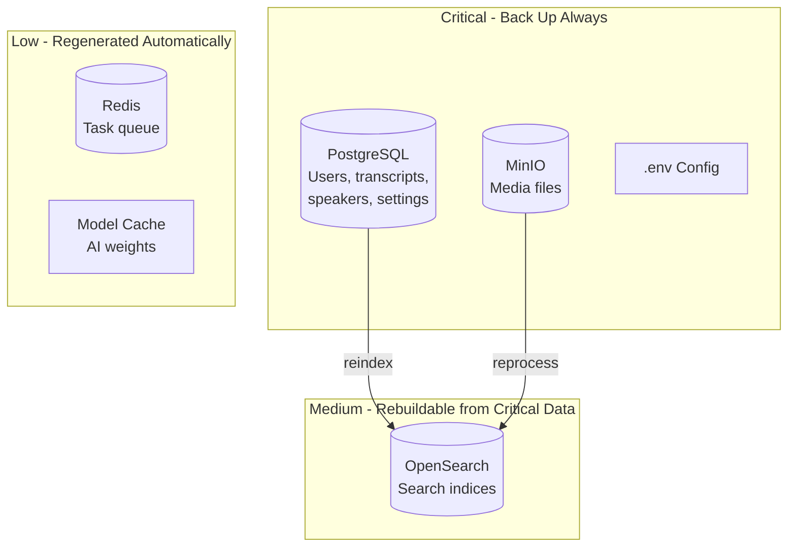

# Backup & Restore

This guide covers backup strategies, restore procedures, and disaster recovery for OpenTranscribe deployments.

## What to Back Up

OpenTranscribe stores data across several services. Understanding each component helps you prioritize your backup strategy.

| Component | Docker Volume / Location | Contents | Priority |
|-----------|--------------------------|----------|----------|
| **PostgreSQL** | `postgres_data` | Users, transcripts, segments, speakers, settings | Critical |
| **MinIO** | `minio_data` | Uploaded media files (audio/video) | Critical |
| **OpenSearch** | `opensearch_data` | Full-text and vector search indices | Medium (rebuildable) |
| **Redis** | `redis_data` | Task queue state, cache | Low (ephemeral) |
| **Model Cache** | `${MODEL_CACHE_DIR:-./models}/` | AI model weights (~2.5GB) | Low (re-downloadable) |
| **Configuration** | `.env`, `docker-compose.*.yml` | Environment and deployment config | Critical |

:::tip Priority Guide
**Critical** components contain irreplaceable data. **Medium** components can be rebuilt from critical data (e.g., reindexing). **Low** components are automatically regenerated or re-downloaded.
:::



## Database Backup

### Using opentr.sh (Recommended)

The built-in backup command creates a timestamped SQL dump:

```bash
./opentr.sh backup
```

This creates a file at `./backups/opentranscribe_backup_YYYYMMDD_HHMMSS.sql`.

### Encrypted Backup

:::warning
Plain backups contain **every user's transcripts in plaintext SQL**. Encrypt any backup that
leaves the host (offsite copies, cloud storage, USB drives).
:::

```bash
./opentr.sh backup --encrypt
```

This pipes `pg_dump` directly into GPG symmetric encryption (AES-256) — the plaintext dump
never touches disk — and prompts for a passphrase. The result is
`./backups/opentranscribe_backup_YYYYMMDD_HHMMSS.sql.gpg`.

Restore detects `.gpg` files automatically:

```bash
./opentr.sh restore backups/opentranscribe_backup_YYYYMMDD_HHMMSS.sql.gpg
```

Store the passphrase in a password manager — an encrypted backup without its passphrase is
unrecoverable. (`--encrypt` requires `gpg`; install with `apt install gnupg` /
`brew install gnupg`.)

### Manual pg_dump

For more control over the backup process:

```bash
# Full database dump
docker compose exec -T postgres pg_dump -U postgres opentranscribe > backup.sql

# Compressed backup (recommended for large databases)
docker compose exec -T postgres pg_dump -U postgres opentranscribe | gzip > backup.sql.gz

# Custom format (supports parallel restore for a manual pg_restore — but see the
# --single-transaction/-j note under Restore Procedures: ./opentr.sh restore's safe path
# deliberately does NOT use -j, so it does not get that parallelism)
docker compose exec -T postgres pg_dump -U postgres -Fc opentranscribe > backup.dump
```

### Automated Backups (in-app, recommended)

OpenTranscribe ships a **built-in scheduled-backup system** that runs on the
stack's existing `celery-beat` service — no host cron, no systemd timer, and
no shell scripting. Everything is configured in the admin UI under
**Settings → System Management → Backups** and stored in the database, so
schedule changes take effect with no restart.

Start the stack with the backup overlay so a destination is mounted:

```bash
# Mounts BACKUP_HOST_PATH (default ./backups) to /backups in the backend + worker
./opentr.sh start dev --with-backup
```

Then, in the admin UI:

- **Enable** scheduled backups and set a **cron schedule** (default `0 3 * * *` — 03:00 daily, UTC).
- Choose a **destination**:
  - **Local folder** — the mounted `/backups` path (set via `BACKUP_HOST_PATH`).
  - **S3-compatible bucket** — any AWS S3 / MinIO / Backblaze-style endpoint. Provide endpoint URL, region, bucket, prefix, and access/secret keys. The secret is encrypted at rest (AES-256-GCM) and never returned by the API; a **Test Connection** button validates it. This lets backups land **off the host machine** entirely.
- Set **GFS retention** (grandfather-father-son: daily / weekly / monthly counts; default 7 / 4 / 12).
- Optionally enable **gpg encryption** (provide a passphrase file path). ⚠️ Currently
  broken on the published production image — `gpg` is not installed
  (`Dockerfile.prod` installs `postgresql-client` but never `gnupg`), so an encrypted
  scheduled/S3 backup fails on every run until [issue #604](https://github.com/attevon-llc/OpenTranscribe/issues/604) lands. Unencrypted
  scheduled backups are unaffected.
- Use **Run Now** to take an immediate backup and see the last result.

Under the hood: a lightweight `backup.check_schedule` beat task fires every few
minutes, evaluates the DB-stored cron against the last run, and dispatches
`backup.run`, which executes `pg_dump --format=custom` directly from the worker
(the backend image ships `postgresql-client`), optionally gpg-encrypts, uploads
to the chosen destination, and prunes old backups by the GFS policy. If the
destination isn't mounted/reachable the task records a clear status and never
crashes.

:::tip Off-host backups
For real disaster resilience, point the destination at an **S3-compatible
bucket on a different machine or provider** — a host failure then can't take
your backups with it. The bucket can be your own MinIO on another box.
:::

Restore an in-app backup with the same `./opentr.sh restore` command as any other backup —
see [Restoring a custom-format (-Fc) or scheduled-backup dump](#restoring-a-custom-format--fc-or-scheduled-backup-dump)
below. For an S3 destination, fetch the artifact first with `--from-s3` — see
[Restoring an S3-destination backup](#restoring-an-s3-destination-backup).

#### OpenSearch snapshots (optional)

The in-app scheduler can **also take an OpenSearch snapshot** alongside each
`pg_dump`. Enable it in the admin UI under **Settings → Backups → "Include
OpenSearch snapshot"**. Because every search index is **rebuildable from
PostgreSQL**, this is a *convenience* (skip the reindex on restore), not a
necessity — leave it off and nothing is lost.

How it works:

- The snapshot runs **only after a successful database dump** and its outcome is
  **independent of the dump** — a snapshot failure never fails the backup. The
  result panel shows a separate "OpenSearch snapshot" status (`ok` / `skipped` /
  `unsupported` / `error`).
- Snapshots use a filesystem (`fs`) repository named `opentranscribe_backup`.
  OpenSearch only permits `fs` repositories whose location is in its
  **`path.repo` allow-list**, so the path must be configured on the OpenSearch
  container. The `--with-backup` overlay does this automatically: it sets
  `path.repo` on the OpenSearch service and bind-mounts
  `BACKUP_HOST_PATH/opensearch-snapshots` into it, so snapshots land beside the
  `.dump` files.
- Snapshot names share the `opentranscribe-YYYYMMDD-HHMMSS` stem of the dumps and
  are pruned by the **same GFS retention** policy.

**Requirement:** start the stack with the backup overlay so `path.repo` is
allow-listed:

```bash
./opentr.sh start dev --with-backup
```

If you enable "Include OpenSearch" **without** the overlay, the feature degrades
gracefully: the database dump still succeeds and the OpenSearch status is recorded
as `unsupported` with a message that `path.repo` is not configured.

**Restoring** an OpenSearch snapshot (only needed if you want to skip a reindex):

```bash
# List snapshots in the repository
curl -s "http://localhost:5180/_snapshot/opentranscribe_backup/_all" | python3 -m json.tool

# Close affected indices, then restore a specific snapshot
curl -X POST "http://localhost:5180/_snapshot/opentranscribe_backup/opentranscribe-20260607-030000/_restore?wait_for_completion=true"
```

:::note S3 destination + snapshots
The shipped OpenSearch image does **not** include the `repository-s3` plugin, so
OpenSearch snapshots always use the local `fs` repository — even when the database
dump destination is an S3 bucket. (The `.dump` files still go to S3; only the
OpenSearch snapshots stay on the `fs` repo path.) Adding the `repository-s3` plugin
to register an `s3` snapshot repository is a possible future enhancement.
:::

:::info MinIO media mirroring
The uploaded **media files** (MinIO objects) are covered by the in-app
[Media Mirror](#media-mirror-in-app-incremental) — a separate scheduled,
incremental, never-deleting copy of the media bucket with its own destination.
:::

#### Media Mirror (in-app, incremental) {/* #media-mirror-in-app-incremental */}

The database dump protects your *metadata*; the **Media Mirror** protects the
**irreplaceable media originals** — the audio/video files in MinIO that cannot be
rebuilt from anything else. It incrementally copies the media bucket to a second
location on its own schedule, using the same celery-beat infrastructure as the
database backup. **Default OFF** — enable it in the admin UI under
**Settings → System Management → Backups → Media Mirror**.

What it copies:

- **Included**: uploaded originals (`user_*/file_*/…`), thumbnails, and speaker
  avatars — everything irreplaceable in the media bucket.
- **Excluded**: regenerable data — preprocessed temp audio (`temp/…`) and,
  defensively, the `derived/` / `bulk/` cache prefixes. (Subtitle-embedded videos
  and export zips live in the separate `processed-videos` cache bucket, which is
  never mirrored — it rebuilds on demand.)

How it works:

- **Incremental**: objects are compared by **size plus ETag** (ETags participate
  only when both sides carry a comparable single-part checksum); up-to-date objects
  are skipped, so the steady-state nightly delta for write-once media is tiny. The
  first run copies everything and can take hours for a large library — a Redis lock
  guarantees runs never overlap, and per-object failures never abort a run (failed
  objects are retried on the next pass).
- **The mirror NEVER deletes.** Files removed from the source bucket — by a
  fat-fingered bulk delete, a bad migration, or ransomware — **remain in the
  mirror** until you remove them yourself. This is an explicit, tested invariant:
  the destination interface has no delete operation at all. The trade-off is that
  the mirror grows monotonically; prune it manually if you need the space back.
- **Separate destination** from the database dumps (a media mirror is large and
  often lives on different storage):
  - **Local folder** — start the stack with the backup overlay
    (`./opentr.sh start dev --with-backup`), which mounts
    `BACKUP_MIRROR_HOST_PATH` (default `./media-mirror`) to `/media-mirror` in the
    backend + download-worker containers. Point it at a NAS mount, external drive,
    or any second disk.
  - **S3-compatible bucket** — any AWS S3 / MinIO / Backblaze-style endpoint on
    **another machine or provider** for a true off-host copy. The secret key is
    encrypted at rest (AES-256-GCM, write-only, never returned by the API) with a
    Test Connection button — the same pattern as the dump destination.
- **Schedule** is a DB-stored cron (default `30 3 * * *` — 03:30 daily, offset from
  the 03:00 database dump); a configurable **throttle** (ms of sleep per object)
  caps I/O pressure on shared disks. The run executes on the **download** worker
  (bulk network I/O), never the GPU worker.
- **Observability** (same pattern as the [failure alerting](#failure-alerting-metrics--notifications)
  below): a failed run sends a `media_mirror_status` WebSocket notification to every
  admin (clean successes are silent); Prometheus exposes
  `media_mirror_last_success_timestamp_seconds`, `media_mirror_last_status`,
  `media_mirror_runs_total{result}`, and per-outcome object counts
  (`media_mirror_last_run_objects{outcome="copied"|"skipped"|"failed"|"excluded"}`).
  The panel shows the last result (objects copied/skipped/failed, bytes, errors)
  and a **Run Now** button.

**Restoring from the mirror.** The mirror preserves the bucket's key layout
(`user_<id>/file_<id>/…`), so restoring is a straight copy back:

```bash
# Folder mirror → restore into a (new) MinIO with mc
mc alias set restored http://localhost:5178 $MINIO_ROOT_USER $MINIO_ROOT_PASSWORD
mc cp --recursive /path/to/media-mirror/ restored/opentranscribe/

# S3 mirror → bucket-to-bucket copy
mc alias set mirror https://mirror-endpoint MIRROR_KEY MIRROR_SECRET
mc cp --recursive mirror/my-mirror-bucket/opentranscribe-media/ restored/opentranscribe/
```

Restore the database dump from the same point in time first, then the media; the
`MediaFile` rows reference objects by these same keys. If the database is *not*
recoverable, `python -m app.scripts.reingest_minio` can re-register restored
objects from storage alone (see the storage-recovery runbook).

:::note Bucket versioning (optional, deployment-level)
The never-delete mirror already protects against source-side deletion. S3/MinIO
**bucket versioning** on the source or mirror bucket is an optional *extra* —
it turns overwrites/deletes into recoverable versions at near-zero steady-state
cost for write-once media — but it is a deployment-level choice (enable it with
`mc version enable <alias>/<bucket>`), **not required** by the mirror and not
managed by OpenTranscribe.
:::

#### Recovery keys travel with the backup

A `pg_dump` contains AES-256-GCM **ciphertext** — user API keys, watch-source
credentials, email passwords, MFA secrets — whose master key (`ENCRYPTION_KEY`)
lives only in `.env`. Restore a dump onto a host with a different key and every
encrypted column is **permanently undecryptable** (see the
[backup-completeness audit](./backup-audit.md)). Each successful scheduled run
therefore writes a **recovery companion** into the destination, beside the dumps:

- **Backup encryption ON** — `opentranscribe-recovery.env.gpg`: the essential env
  keys (`ENCRYPTION_KEY`, `JWT_SECRET_KEY`, and `MINIO_KMS_SECRET_KEY` when set),
  gpg-symmetric-encrypted with the **same passphrase** as the dumps. Your gpg
  passphrase (kept in a password manager, never on the backup media) then unlocks
  both the dump and its keys — the destination alone is sufficient for a full
  restore. To recover the keys: `gpg -d opentranscribe-recovery.env.gpg`.
- **Backup encryption OFF** — plaintext keys are deliberately **not** written next
  to a plaintext dump. Instead a `RECOVERY-README.txt` names the keys you must
  preserve separately, with SHA-256 fingerprints (no values) so a restore drill can
  verify the keys you saved match the ones that wrote the data. A **one-time admin
  notification** also warns that the dumps alone are not restorable.

There is exactly **one companion per destination**, refreshed on every successful
run — the keys must match the *current* database ciphertext, so an always-current
copy is the correct semantic. The last-run panel in the admin UI shows a
"Recovery keys" status (`included` / `not included` / `error`); a companion failure
never fails the backup itself.

#### Failure alerting (metrics + notifications)

A silently failing backup is worse than none. Every recorded run is surfaced
proactively:

- **Admin notifications** — a failed run (pg_dump error, unmounted destination,
  unreachable bucket) sends a `backup_status` WebSocket notification to every
  admin with the persisted error message. A run that succeeds **with warnings**
  (retention pruning failed, OpenSearch snapshot failed, recovery companion
  failed) sends a warning notification — the dump itself is still recorded as
  successful.
- **Prometheus metrics** (scraped from the backend's `/metrics`; see
  [Monitoring](./monitoring.md)):
  - `backup_last_success_timestamp_seconds` — Unix time of the last successful
    run (0 = never). Alert on staleness:
    `time() - backup_last_success_timestamp_seconds > 2 * 86400`.
  - `backup_last_status` — 1 = last run succeeded, 0 = failed.
  - `backup_runs_total{result="success"|"failure"}` — cumulative run counter.

  The backup executes in a Celery worker, so these are persisted to the database
  by the run task and projected onto the API's collectors at scrape time — they
  survive backend restarts.
- **Admin UI** — the Backups panel shows the full last result, including the
  error message, prune warnings, OpenSearch snapshot status, and the recovery
  companion status.

### Automated Backup with Cron (alternative)

If you prefer OS-level scheduling instead of the in-app scheduler, set up
automatic daily backups with cron:

```bash
# Edit crontab
crontab -e

# Add daily backup at 2:00 AM
0 2 * * * cd /opt/opentranscribe && ./opentr.sh backup

# With log rotation (keep last 30 days)
0 2 * * * cd /opt/opentranscribe && ./opentr.sh backup && find ./backups -name "*.sql" -mtime +30 -delete
```

### Automated Backup with systemd Timer

For systems using systemd:

```ini
# /etc/systemd/system/opentranscribe-backup.service
[Unit]
Description=OpenTranscribe Database Backup

[Service]
Type=oneshot
WorkingDirectory=/opt/opentranscribe
ExecStart=/opt/opentranscribe/opentr.sh backup
ExecStartPost=/usr/bin/find /opt/opentranscribe/backups -name "*.sql" -mtime +30 -delete
```

```ini
# /etc/systemd/system/opentranscribe-backup.timer
[Unit]
Description=Daily OpenTranscribe Backup

[Timer]
OnCalendar=*-*-* 02:00:00
Persistent=true

[Install]
WantedBy=timers.target
```

```bash
# Enable the timer
sudo systemctl daemon-reload
sudo systemctl enable --now opentranscribe-backup.timer

# Check timer status
sudo systemctl list-timers opentranscribe-backup.timer
```

## MinIO / Storage Backup

:::tip Prefer the in-app Media Mirror
The scheduled, incremental, never-deleting
[Media Mirror](#media-mirror-in-app-incremental) covers this automatically —
the manual `mc` approaches below remain useful for one-off copies and
non-standard destinations.
:::

MinIO stores all uploaded media files. Back up using the MinIO Client (`mc`):

```bash
# Install mc (if not already available)
docker run --rm -it --entrypoint /bin/sh minio/mc

# Or use mc from within the MinIO container
docker compose exec minio mc alias set local http://localhost:9000 $MINIO_ROOT_USER $MINIO_ROOT_PASSWORD

# Mirror all buckets to a local directory
docker compose exec minio mc mirror local/ /backup-destination/

# Or from the host with mc installed
mc alias set opentranscribe http://localhost:5178 $MINIO_ROOT_USER $MINIO_ROOT_PASSWORD
mc mirror opentranscribe/ ./backups/minio/
```

### Volume-Level Backup

Alternatively, back up the Docker volume directly:

```bash
# Stop MinIO to ensure consistency
docker compose stop minio

# Copy volume data
docker run --rm -v opentranscribe_minio_data:/data -v $(pwd)/backups:/backup \
  alpine tar czf /backup/minio_data_$(date +%Y%m%d).tar.gz -C /data .

# Restart MinIO
docker compose start minio
```

:::warning
Volume-level backups require stopping the MinIO container to ensure data consistency. Use `mc mirror` for online backups.
:::

## OpenSearch Backup

OpenSearch indices can be rebuilt by reindexing from PostgreSQL, but backing them up avoids reindex time.

### Snapshot Repository

```bash
# Register a snapshot repository (filesystem-based)
curl -X PUT "http://localhost:5180/_snapshot/backup_repo" -H 'Content-Type: application/json' -d '{
  "type": "fs",
  "settings": {
    "location": "/usr/share/opensearch/backup"
  }
}'

# Create a snapshot
curl -X PUT "http://localhost:5180/_snapshot/backup_repo/snapshot_$(date +%Y%m%d)?wait_for_completion=true"

# List snapshots
curl -s "http://localhost:5180/_snapshot/backup_repo/_all" | python3 -m json.tool
```

:::note
For filesystem snapshots, you need to mount a backup directory into the OpenSearch container and add `path.repo` to the OpenSearch configuration. For most deployments, simply reindexing after a restore is simpler.
:::

### Rebuilding Instead of Restoring

If you skip OpenSearch backups, you can rebuild indices after restoring PostgreSQL:

1. Start all services
2. Go to **Admin Settings** in the UI
3. Use the **Reindex All** function to rebuild search indices from the database

## Configuration Backup

Always back up your environment configuration:

```bash
# Back up .env (contains secrets - store securely)
cp .env ./backups/.env.$(date +%Y%m%d)

# Back up any custom compose overrides
cp docker-compose.local.yml ./backups/ 2>/dev/null
cp docker-compose.gpu-scale.yml ./backups/ 2>/dev/null
```

:::danger
The `.env` file contains database passwords, API keys, and encryption keys. Store configuration backups securely and never commit them to version control.
:::

## Model Cache

The model cache (`${MODEL_CACHE_DIR:-./models}/`) contains downloaded AI model weights (~2.5GB total). These are automatically re-downloaded on first use, so backing them up is only necessary for **offline/air-gapped deployments**.

```bash
# Only needed for offline deployments
tar czf backups/models_$(date +%Y%m%d).tar.gz -C ${MODEL_CACHE_DIR:-./models} .
```

## Automated Backup Schedule

Here is a recommended backup schedule combining all components:

```bash
#!/bin/bash
# /opt/opentranscribe/scripts/full-backup.sh
set -euo pipefail

BACKUP_DIR="/opt/opentranscribe/backups/$(date +%Y%m%d_%H%M%S)"
mkdir -p "$BACKUP_DIR"

cd /opt/opentranscribe

# 1. Database (critical)
docker compose exec -T postgres pg_dump -U postgres opentranscribe | gzip > "$BACKUP_DIR/database.sql.gz"
echo "Database backup complete."

# 2. Configuration (critical)
cp .env "$BACKUP_DIR/.env"
cp docker-compose.local.yml "$BACKUP_DIR/" 2>/dev/null || true

# 3. MinIO media files (critical, can be large)
docker run --rm -v opentranscribe_minio_data:/data -v "$BACKUP_DIR":/backup \
  alpine tar czf /backup/minio_data.tar.gz -C /data .
echo "MinIO backup complete."

# 4. Cleanup old backups (keep 30 days)
find /opt/opentranscribe/backups -maxdepth 1 -type d -mtime +30 -exec rm -rf {} +

echo "Full backup complete: $BACKUP_DIR"
```

```bash
# Cron: run full backup weekly, database-only backup daily
# Daily database backup at 2:00 AM
0 2 * * * cd /opt/opentranscribe && ./opentr.sh backup

# Weekly full backup at 3:00 AM on Sundays
0 3 * * 0 /opt/opentranscribe/scripts/full-backup.sh
```

## Restore Procedures

### Restoring the Database

Using `opentr.sh`:

```bash
./opentr.sh restore backups/opentranscribe_backup_20260310_020000.sql
```

:::warning Destructive — full replace, not a merge
This **replaces the database entirely**. A plain `pg_dump` file has no `DROP`/`--clean`
statements, so replaying it into an already-populated database used to fail on every
statement while `psql` still reported success (issue #599) — and worse, could leave the
migration-tracking table with two conflicting rows. `restore` now guarantees an exact
restore instead.
:::

This command automatically:
1. **Confirms** — shows the current database's row counts and alembic head vs. the
   backup's, and requires typing the database name to proceed (skip with `--yes` for
   scripted use)
2. **Takes a safety dump** of the *current* database first (`--no-safety-dump` to skip —
   not recommended), so the pre-restore state is recoverable if anything goes wrong
3. Stops backend and all Celery workers
4. **Drops and recreates** the database (`DROP DATABASE ... WITH (FORCE)` + `CREATE
   DATABASE`), guaranteeing an empty target regardless of schema drift since the backup
5. **Replays** the dump inside a single transaction — a failure rolls back to nothing
   rather than leaving a half-restored, hybrid schema
6. **Verifies** the result (row/table counts, exactly one migration-version row matching
   the backup) before reporting success, then restarts services

`opentr.sh restore --help`-equivalent usage: `./opentr.sh restore [--yes] [--no-safety-dump] <file>`.

:::note MinIO / OpenSearch are not rolled back
`opentr.sh backup`/`restore` cover **PostgreSQL only**. After a restore, MinIO (media
files) and OpenSearch (search indices) may be ahead of or behind the restored database —
media with no row, rows with no media, stale search hits. Reindex from **Admin → Search**
if the restored database's file list differs from what MinIO/OpenSearch currently have.
:::

### Restoring a custom-format (`-Fc`) or scheduled-backup dump

`./opentr.sh restore` above handles **both** dump formats — it's the same command for
either, not a separate procedure. It sniffs the file's `PGDMP` magic bytes and, for a
custom-format `.dump`/`.dump.gpg` (what the in-app scheduled/S3 backup produces, and what
`pg_dump -Fc` produces manually), replays it with `pg_restore --exit-on-error
--single-transaction --no-owner --no-privileges` instead of `psql` — reusing the exact same
confirm / safety-dump / drop-recreate / verify sequence described above (issue #600):

```bash
./opentr.sh restore backups/opentranscribe-20260827-030000.dump
# or, encrypted:
./opentr.sh restore backups/opentranscribe-20260827-030000.dump.gpg
```

:::danger Do not "fix" a missing stdin redirect by hand
An earlier version of this page showed `docker compose exec -T postgres pg_restore -U
postgres -d opentranscribe backup.dump` — that fails outright (`could not open input file`,
the path resolves *inside* the postgres container). Adding `< backup.dump` to fix the
redirect reproduces issue #599's exact silent-corruption bug for `pg_restore`: drifted data
survives, and `alembic_version` ends with two conflicting rows. Unlike `psql`, `pg_restore`
does exit nonzero here (`warning: errors ignored on restore: N`) — but it has **already
committed the partial damage** by the time it prints that, so the nonzero exit is not the
safety net it looks like. Use `./opentr.sh restore` above; it guarantees an empty target
before replaying, exactly like the plain-SQL path.
:::

#### Restoring an S3-destination backup

An S3-destination scheduled backup exists **only in the bucket** — the local artifact is
deleted right after upload. The S3 credentials needed to fetch it back are encrypted in the
database, so:

☠️ **Fetch the artifact BEFORE anything destructive happens** — the credentials to reach
your bucket live inside the very database a restore is about to drop.

```bash
./opentr.sh restore --from-s3 opentranscribe-20260827-030000.dump
```

This fetches the named object out of the configured S3 destination (via
`app.scripts.fetch_backup` inside the backend container, the only place the decryption key
is available) into `${BACKUP_HOST_PATH:-./backups}`, verifying its size and magic bytes,
*then* runs the normal restore flow above. It refuses (naming the manual two-step below) if
the backend container isn't running. Manual fallback:

```bash
docker compose exec -T backend python -m app.scripts.fetch_backup --list
docker compose exec -T backend python -m app.scripts.fetch_backup opentranscribe-20260827-030000.dump
./opentr.sh restore "${BACKUP_HOST_PATH:-./backups}/opentranscribe-20260827-030000.dump"
```

#### If you specifically need `pg_restore`'s parallel restore (`-j`)

`./opentr.sh restore`'s safe path uses `--single-transaction`, which is **mutually
exclusive** with `-j`/`--jobs` (measured: `pg_restore: error: cannot specify both
--single-transaction and multiple jobs`) — so it deliberately forfeits parallel restore for
the atomicity guarantee (a failure rolls back to nothing, not a hybrid schema). An operator
who knowingly wants `-j` for a very large database can run it by hand, accepting that
tradeoff explicitly:

```bash
# Stop services that use the database
docker compose stop backend celery-worker celery-download-worker \
  celery-cpu-worker celery-nlp-worker celery-embedding-worker celery-beat

# Guarantee an empty target first — pg_restore --clean is NOT enough (it only drops
# objects the dump itself knows about, so a later migration's table would survive).
docker compose exec -T postgres psql -U postgres -d postgres \
  -c 'DROP DATABASE IF EXISTS "opentranscribe" WITH (FORCE);' \
  -c 'CREATE DATABASE "opentranscribe" OWNER "postgres";'

# Parallel restore — no atomicity guarantee: a failure partway through leaves a
# hybrid schema, not a clean rollback.
docker compose exec -T postgres pg_restore -U postgres -d opentranscribe -j 4 \
  --no-owner --no-privileges < backup.dump

# Restart services
docker compose start backend celery-worker celery-download-worker \
  celery-cpu-worker celery-nlp-worker celery-embedding-worker celery-beat
```

### Restoring MinIO Data

```bash
# Stop MinIO
docker compose stop minio

# Restore volume from tar backup
docker run --rm -v opentranscribe_minio_data:/data -v $(pwd)/backups:/backup \
  alpine sh -c "rm -rf /data/* && tar xzf /backup/minio_data.tar.gz -C /data"

# Start MinIO
docker compose start minio
```

### Restoring OpenSearch

If you have a snapshot:

```bash
# Close indices first
curl -X POST "http://localhost:5180/_all/_close"

# Restore from snapshot
curl -X POST "http://localhost:5180/_snapshot/backup_repo/snapshot_20260310/_restore?wait_for_completion=true"
```

If you do not have a snapshot, reindex from the database using the Admin UI after PostgreSQL is restored.

### Restoring Configuration

```bash
# Restore .env (review before applying - may contain stale values)
cp backups/.env /opt/opentranscribe/.env

# Restart all services to pick up configuration
docker compose down
docker compose up -d
```

## Disaster Recovery

### Full System Recovery from Scratch

If you need to rebuild the entire system from backups:

```bash
# 1. Install Docker and Docker Compose on the new server

# 2. Clone or copy the OpenTranscribe repository
git clone https://github.com/attevon-llc/OpenTranscribe.git /opt/opentranscribe
cd /opt/opentranscribe

# 3. Restore configuration
cp /path/to/backup/.env .env

# 4. Start infrastructure services only
docker compose up -d postgres minio redis opensearch

# 5. Wait for PostgreSQL to be ready
until docker compose exec postgres pg_isready -U postgres; do sleep 2; done

# 6. Restore the database
docker compose exec -T postgres psql -U postgres opentranscribe < /path/to/backup/database.sql

# 7. Restore MinIO data
docker run --rm -v opentranscribe_minio_data:/data -v /path/to/backup:/backup \
  alpine sh -c "tar xzf /backup/minio_data.tar.gz -C /data"

# 8. Start all remaining services
docker compose up -d

# 9. Reindex OpenSearch (via Admin UI or API)
# The backend will run Alembic migrations automatically on startup

# 10. Verify the system
curl -f http://localhost:5174/api/health
```

### RTO/RPO Considerations

| Metric | Target | How to Achieve |
|--------|--------|----------------|
| **RPO** (max data loss) | 24 hours | Daily database backups |
| **RPO** (aggressive) | 1 hour | Hourly database backups + WAL archiving |
| **RTO** (time to recover) | 1-2 hours | Documented recovery runbook + tested backups |
| **RTO** (aggressive) | 15-30 minutes | Pre-staged infrastructure + automated restore scripts |

For lower RPO, consider PostgreSQL WAL (Write-Ahead Log) archiving for point-in-time recovery.

## Testing Backups

Untested backups are not backups. Verify your backups regularly:

```bash
# 1. Create a test database
docker compose exec postgres createdb -U postgres opentranscribe_test

# 2. Restore backup into test database (ON_ERROR_STOP so a replay failure is loud, not
#    silent — see issue #599. No DROP needed: opentranscribe_test is already empty.)
docker compose exec -T postgres psql -v ON_ERROR_STOP=1 -U postgres opentranscribe_test < backups/opentranscribe_backup_latest.sql

# 3. Verify row counts
docker compose exec postgres psql -U postgres opentranscribe_test -c "
  SELECT 'users' as table_name, count(*) FROM \"user\"
  UNION ALL
  SELECT 'media_files', count(*) FROM media_file
  UNION ALL
  SELECT 'transcripts', count(*) FROM transcript_segment;
"

# 4. Clean up test database
docker compose exec postgres dropdb -U postgres opentranscribe_test
```

The same drill for a custom-format (`-Fc`) or scheduled-backup artifact, using
`pg_restore` (issue #600):

```bash
# 1. Create a test database
docker compose exec postgres createdb -U postgres opentranscribe_test

# 2. Restore into it — --exit-on-error --single-transaction so a replay failure rolls
#    back to nothing rather than a hybrid schema. No drop/--clean needed:
#    opentranscribe_test is already empty.
docker compose exec -T postgres pg_restore -U postgres -d opentranscribe_test \
  --exit-on-error --single-transaction --no-owner --no-privileges < backups/opentranscribe-latest.dump

# 3. Verify — same query as above
docker compose exec postgres psql -U postgres opentranscribe_test -c "
  SELECT 'users' as table_name, count(*) FROM \"user\"
  UNION ALL
  SELECT 'media_files', count(*) FROM media_file
  UNION ALL
  SELECT 'transcripts', count(*) FROM transcript_segment;
"

# 4. Clean up test database
docker compose exec postgres dropdb -U postgres opentranscribe_test
```

Or skip both hand-rolled drills and just run the real thing against a throwaway copy —
`./opentr.sh restore` handles both formats and does the drop/recreate + verify for you.

:::tip
Schedule a quarterly disaster recovery drill where you restore from backup onto a separate machine to validate the entire recovery process end-to-end.
:::
