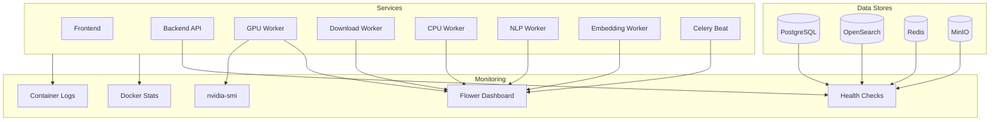

# Monitoring & Logging

OpenTranscribe runs as a multi-service Docker Compose application with GPU-accelerated AI processing, background task queues, and several data stores. Effective monitoring ensures reliable operation and early detection of issues.

OpenTranscribe ships with a **built-in, fully self-hosted observability stack** — Prometheus + Grafana scraping a native FastAPI `/metrics` endpoint, plus structured JSON access logs. There is no Google Analytics or third-party SaaS telemetry: all metrics stay on your infrastructure. The sections immediately below cover this built-in stack; later sections cover the standing operational tooling (Flower, health checks, `nvidia-smi`, log management) and how to plug into external monitoring (CloudWatch, Datadog, etc.).

## Built-in Metrics & Dashboards

### What the backend exposes

The backend instruments every HTTP request and database query and exposes them in Prometheus format. Two unauthenticated endpoints are mounted at the application root (next to `/health`), **not** under `/api` and **never proxied by nginx** — they are reachable only from inside the Docker network:

| Endpoint | Purpose |
|----------|---------|
| `GET /metrics` | Prometheus exposition format. Request latency/RPS/errors by route template, **DB queries per request** (the duplicate-call / N+1 detector), DB query latency, in-flight requests, cache hit/miss counters, Celery queue depth, and product counters (signups, uploads). |
| `GET /health/ready` | Readiness probe for load balancers / Kubernetes. Checks Postgres + Redis (critical → 503 if down) and OpenSearch + MinIO (degraded-but-ready). Returns `{"status": "ready", "checks": {...}}`. The original `GET /health` (static 200) is unchanged and still drives the Docker healthcheck. |

Key metric names (stable; dashboards are built against these):

| Metric | Type | Labels |
|--------|------|--------|
| `http_request_duration_seconds` | Histogram | `method`, `route`, `status` |
| `http_requests_total` | Counter | `method`, `route`, `status` (5xx rate derived in Grafana) |
| `http_requests_in_flight` | Gauge | — |
| `db_query_duration_seconds` | Histogram | — (no statement/table labels — cardinality) |
| `db_queries_per_request` | Histogram | `method`, `route` |
| `cache_operations_total` | Counter | `cache` (`redis`/`settings`), `result` (`hit`/`miss`) |
| `celery_queue_depth` | Gauge | `queue` |
| `user_signups_total` | Counter | `method` (`local`/`ldap`/`keycloak`/`pki`/`external`) |
| `files_uploaded_total` | Counter | `source` (`upload`/`url`/`watch`) |

:::note Route labels use the route **template** (e.g. `/api/files/{file_id}`), never the raw path or query string — this bounds cardinality and keeps tokens/PII out of metrics. `user_id`/`org_id` are written to the JSON **access log** only, never as Prometheus labels.
:::

:::info Worker-side product events (transcription outcomes, processed minutes, watch-source imports) happen in Celery workers, whose Prometheus registries are never scraped. Those are dashboarded from the database via Grafana's PostgreSQL datasource (the Product dashboard below), not from Prometheus counters.
:::

### Starting the stack

The Prometheus + Grafana overlay is **optional** and started with a single flag:

```bash
./opentr.sh start dev --with-monitoring
```

This loads `docker-compose.monitoring.yml` and brings up:

| Service | URL | Notes |
|---------|-----|-------|
| Prometheus | http://localhost:5186 | 15s scrape of `backend:8080/metrics`; 15-day retention |
| Grafana | http://localhost:5185 | Login `admin` / `$GRAFANA_PASSWORD` (default `admin`) |

Both containers run `no-new-privileges`, `restart: unless-stopped`, with read-only config mounts and named data volumes. Grafana anonymous access and self-signup are disabled. Override the host ports with `PROMETHEUS_PORT` / `GRAFANA_PORT` and the password with `GRAFANA_PASSWORD` in `.env`.

Omit the flag and the stack runs completely unchanged — the overlay adds nothing to the base services.

Verify after start: Prometheus → **Status → Targets** shows `opentranscribe-backend` UP; Grafana → **Dashboards → OpenTranscribe** lists both dashboards and renders data after you click around the app.

### Dashboard tour

Two dashboards are auto-provisioned into the **OpenTranscribe** folder:

**OpenTranscribe — Backend Ops** (`opentranscribe.json`, Prometheus datasource):

- **Request latency p50 / p95 / p99 by route** — `histogram_quantile(...)` over `http_request_duration_seconds_bucket`. The histogram buckets run out to 600s so long uploads don't saturate p99 at `+Inf`.
- **Requests per second by route** and **5xx error rate** (fraction of all requests).
- **Requests in flight** — a stat panel off `http_requests_in_flight`; watch this near the DB pool ceiling.
- **DB queries per request — p95 by route** — the duplicate-call radar. A route whose p95 jumps to dozens of queries is doing N+1 or repeated identical lookups within one request.
- **DB query latency p99 / p95** and **cache hit ratio by cache** (split by the `redis` / `settings` cache label).
- **Celery queue depth by queue** (summed across priority sub-keys).
- **Signups / uploads rate** product counters (API-process events).

**OpenTranscribe — Product & Usage** (`product.json`, mixed datasources):

- **Signups over time by method** and **uploads over time by source** — from Prometheus (`user_signups_total`, `files_uploaded_total`).
- **DAU / WAU** and **daily active users** — distinct `user_id` from the `refresh_token` table (a refresh token is minted per login), via the PostgreSQL datasource.
- **Files completed per day**, **transcription minutes processed per day** (`file_pipeline_timing.audio_duration_s`), and **files by status over time** / **current error+orphaned count** — straight from `media_file` / `file_pipeline_timing`. This is how worker-side product events are tracked without Prometheus.

### The PostgreSQL datasource (read-only role for production)

The Product dashboard reads the database directly through a provisioned Grafana **PostgreSQL datasource** (UID `opentranscribe-pg`). In dev it reuses the stack's Postgres credentials for convenience. **In production, point it at a dedicated read-only role** instead of the application superuser. Create one (idempotently) and grant it read access:

```sql
-- Run once against the OpenTranscribe database, as a superuser.
DO $$
BEGIN
  IF NOT EXISTS (SELECT 1 FROM pg_roles WHERE rolname = 'grafana_ro') THEN
    CREATE ROLE grafana_ro LOGIN PASSWORD 'CHANGE_ME_strong_password';
  END IF;
END
$$;

GRANT CONNECT ON DATABASE opentranscribe TO grafana_ro;
GRANT USAGE ON SCHEMA public TO grafana_ro;
GRANT SELECT ON ALL TABLES IN SCHEMA public TO grafana_ro;
-- Make future tables readable too:
ALTER DEFAULT PRIVILEGES IN SCHEMA public GRANT SELECT ON TABLES TO grafana_ro;
```

Then set the datasource's user/password to `grafana_ro` (the datasource is provisioned `editable: true`, so you can repoint it from **Connections → Data sources** in the Grafana UI, or pass `grafana_ro` credentials via the `POSTGRES_*` env vars the overlay forwards). OpenTranscribe does **not** create this role for you — provision it deliberately as part of your production setup.

### Per-user / per-tenant analysis via JSON access logs

Set `LOG_FORMAT=json` (in `.env`, then recreate the backend container — env changes need a recreate, not just a restart) to emit one structured JSON object per request on the `access` logger. Each line carries `user_id`, `org_id` (null in the self-hosted edition), `request_id`, `route` (template), `method`, `status`, `duration_ms`, `db_query_count`, and `client_ip`.

Because Prometheus deliberately omits `user_id` (cardinality), this is where per-user and per-tenant analysis lives — DAU/WAU by tenant, onboarding funnels (first login → first upload → first transcript view, by route template), and per-user request volumes. Pipe the logs into any log-analytics tool:

```bash
# Quick local analysis: top routes by request count today
./opentr.sh logs backend | grep '"message": "request"' | jq -r '.route' | sort | uniq -c | sort -rn | head
```

In `text` mode (the default) the same fields are folded into a human-readable one-liner, so logs stay readable without JSON tooling.

### AWS / cloud notes

The built-in stack is portable to managed AWS services with no code change:

- **Amazon Managed Prometheus (AMP)** scrapes the identical `backend:8080/metrics` endpoint — point an AMP scraper or an ADOT/Prometheus agent (or a Kubernetes `podMonitor`) at it. Keep `/metrics` off any public Ingress; it is internal-only by design.
- **Amazon Managed Grafana (AMG)**: import both dashboard JSONs as-is. The Ops dashboard is pure PromQL (fully portable); the Product dashboard's PostgreSQL panels just need an AMG PostgreSQL datasource pointed at your RDS instance (use the read-only role above on RDS).
- **CloudWatch Logs**: set `LOG_FORMAT=json` and let Fluent Bit / the CloudWatch agent ship the structured access lines. **CloudWatch Logs Insights** then queries `user_id` / `org_id` / `route` / `duration_ms` directly for DAU/WAU and funnels.
- **Readiness**: switch your load balancer / Kubernetes `readinessProbe` from `/health` to `/health/ready` so traffic is only routed once Postgres and Redis are actually reachable.

:::tip Future tweak: uvicorn emits its own access log line next to OpenTranscribe's structured one (duplicate request lines). This is left as-is because changing the container `CMD` is a behavior change for existing log consumers; in production you can add `--no-access-log` to the uvicorn command to drop the duplicate and rely solely on the structured access logger.
:::

## Monitoring Architecture



## Service Health Checks

Every service in OpenTranscribe has a Docker health check. These are defined in `docker-compose.yml` and automatically monitored by Docker.

| Service | Container | Health Check | Interval | What It Verifies |
|---------|-----------|-------------|----------|------------------|
| PostgreSQL | `opentranscribe-postgres` | `pg_isready -U postgres` | 5s | Database accepts connections |
| MinIO | `opentranscribe-minio` | `curl -f http://localhost:9000/minio/health/live` | 5s | Object storage API is responsive |
| Redis | `opentranscribe-redis` | `redis-cli ping` (with auth if configured) | 5s | Cache/broker responds to PING |
| OpenSearch | `opentranscribe-opensearch` | `curl -sS http://localhost:9200` | 5s | Search cluster is reachable |
| Backend | `opentranscribe-backend` | `curl -f http://localhost:8080/health` | 10s | FastAPI app is serving requests |
| GPU Worker | `opentranscribe-celery-worker` | `celery inspect ping -d gpu-transcription@$HOSTNAME` | 30s | Worker is connected to broker and responsive |
| Download Worker | `opentranscribe-celery-download-worker` | `celery inspect ping -d media-downloader@$HOSTNAME` | 30s | Worker is connected and processing downloads |
| CPU Worker | `opentranscribe-celery-cpu-worker` | `celery inspect ping -d cpu-processor@$HOSTNAME` | 30s | Worker handles CPU-bound tasks |
| NLP Worker | `opentranscribe-celery-nlp-worker` | `celery inspect ping -d ai-nlp@$HOSTNAME` | 30s | Worker handles LLM/NLP tasks |
| Embedding Worker | `opentranscribe-celery-embedding-worker` | `celery inspect ping -d search-indexer@$HOSTNAME` | 30s | Worker handles search embedding tasks |
| Celery Beat | `opentranscribe-celery-beat` | Checks `/app/celerybeat-schedule` modification time < 300s | 30s | Scheduler is writing schedule file |
| Flower | `opentranscribe-flower` | Web UI on port 5555 | N/A | Monitoring dashboard is accessible |

Check all health statuses at once:

```bash
docker ps --format "table {{.Names}}\t{{.Status}}\t{{.Ports}}"
```

## Flower Dashboard

Flower provides real-time monitoring of all Celery workers and tasks.

**Access:** `http://localhost:5175/flower`
**Default credentials:** `admin` / `flower` (configurable via `FLOWER_USER` and `FLOWER_PASSWORD` in `.env`)

### What to Monitor in Flower

| Tab | Key Metrics | What to Look For |
|-----|-------------|------------------|
| **Dashboard** | Active/processed/failed task counts | Failed count increasing, active count stuck |
| **Workers** | Online workers, task counts per worker | Workers offline, uneven task distribution |
| **Tasks** | Task state, runtime, args | Tasks stuck in STARTED for too long, repeated failures |
| **Queues** | Queue depth per queue | Messages backing up in `gpu` queue |
| **Broker** | Redis connection status | Broker connectivity issues |

### Queue Architecture

OpenTranscribe uses dedicated queues for different workload types:

| Queue | Worker | Concurrency | Purpose |
|-------|--------|-------------|---------|
| `gpu` | `celery-worker` | 1 (default) | Transcription + diarization (GPU-bound) |
| `download` | `celery-download-worker` | 3 | Media URL downloads (I/O-bound) |
| `cpu,utility` | `celery-cpu-worker` | 8 | CPU-bound processing tasks |
| `nlp,celery` | `celery-nlp-worker` | 4 | LLM summarization, speaker ID |
| `embedding` | `celery-embedding-worker` | 1 | Search index embedding generation |

### Flower Configuration

Flower is configured with these operational settings in `docker-compose.yml`:

- `--max_tasks=10000` -- retains last 10,000 tasks in the dashboard
- `--persistent=True` -- persists task history to `/app/flower.db`
- `--purge_offline_workers=600` -- removes offline workers after 10 minutes
- `--natural_time=True` -- displays human-readable timestamps

## Docker Container Monitoring

### Resource Usage

```bash
# Live resource usage for all containers
docker stats

# One-shot snapshot
docker stats --no-stream

# Specific container
docker stats opentranscribe-celery-worker
```

### Restart Counts

Frequent restarts indicate instability (often OOM kills or crash loops):

```bash
# Check restart counts
docker inspect --format='{{.Name}}: {{.RestartCount}}' $(docker ps -aq) 2>/dev/null | sort -t: -k2 -nr

# Check if a container was OOM killed
docker inspect --format='{{.Name}}: OOMKilled={{.State.OOMKilled}}' $(docker ps -aq) 2>/dev/null
```

### Container Events

```bash
# Watch for container start/stop/die events
docker events --filter 'type=container' --format '{{.Time}} {{.Actor.Attributes.name}} {{.Action}}'
```

## GPU Monitoring

### nvidia-smi

```bash
# One-shot GPU status
nvidia-smi

# Continuous monitoring (updates every 1 second)
watch -n 1 nvidia-smi

# Compact output with utilization and memory
nvidia-smi --query-gpu=index,name,utilization.gpu,memory.used,memory.total,temperature.gpu --format=csv,noheader,nounits
```

### VRAM Profiling

OpenTranscribe includes built-in VRAM profiling that uses NVML (not PyTorch) for accurate device-level memory tracking. This captures memory used by CTranslate2, which is invisible to `torch.cuda.memory_allocated()`.

Enable profiling:

```bash
# In .env
ENABLE_VRAM_PROFILING=true
```

View profiling results:

```bash
# Via Admin API
curl http://localhost:5174/api/admin/gpu-profiles

# Via profiling test script
./scripts/gpu-profile-test.sh --results
```

### Key GPU Metrics

| Metric | Normal Range | Warning Threshold |
|--------|-------------|-------------------|
| GPU Utilization | 80-100% during transcription | Sustained 0% with queued tasks |
| VRAM Usage (idle) | ~5.5 GB (models loaded) | N/A |
| VRAM Usage (transcription) | +300-400 MB above idle | N/A |
| VRAM Usage (diarization) | +1-11 GB (scales with audio length) | >90% of total VRAM |
| Temperature | 40-80 C | >85 C sustained |

## Database Monitoring

### PostgreSQL

```bash
# Connection count
docker exec opentranscribe-postgres psql -U postgres -d opentranscribe -c \
  "SELECT count(*) as connections FROM pg_stat_activity;"

# Active queries
docker exec opentranscribe-postgres psql -U postgres -d opentranscribe -c \
  "SELECT pid, state, query_start, query FROM pg_stat_activity WHERE state = 'active';"

# Table sizes
docker exec opentranscribe-postgres psql -U postgres -d opentranscribe -c \
  "SELECT relname AS table, pg_size_pretty(pg_total_relation_size(relid)) AS size
   FROM pg_catalog.pg_statio_user_tables ORDER BY pg_total_relation_size(relid) DESC LIMIT 10;"

# Slow queries (if pg_stat_statements is enabled)
docker exec opentranscribe-postgres psql -U postgres -d opentranscribe -c \
  "SELECT calls, mean_exec_time::numeric(10,2) AS avg_ms, query
   FROM pg_stat_statements ORDER BY mean_exec_time DESC LIMIT 5;"

# Cache hit ratio (should be >95%)
docker exec opentranscribe-postgres psql -U postgres -d opentranscribe -c \
  "SELECT round(100.0 * sum(blks_hit) / nullif(sum(blks_hit + blks_read), 0), 2) AS cache_hit_ratio
   FROM pg_stat_database WHERE datname = 'opentranscribe';"
```

### Connection Limits

The default `max_connections` is 200 (configurable via `PG_MAX_CONNECTIONS` in `.env`). Monitor connection usage to avoid exhaustion -- each backend instance, Celery worker, and Flower connection consumes a slot.

## OpenSearch Monitoring

```bash
# Cluster health (green/yellow/red)
curl -s http://localhost:5180/_cluster/health | python3 -m json.tool

# Index stats (document counts, sizes)
curl -s http://localhost:5180/_cat/indices?v

# Node stats (JVM heap, disk, CPU)
curl -s http://localhost:5180/_nodes/stats/jvm,os,fs | python3 -m json.tool

# Pending tasks
curl -s http://localhost:5180/_cluster/pending_tasks | python3 -m json.tool

# ML model status (neural search)
curl -s http://localhost:5180/_plugins/_ml/models/_search -H 'Content-Type: application/json' \
  -d '{"query":{"match_all":{}}}'
```

### OpenSearch Health Status

| Status | Meaning | Action |
|--------|---------|--------|
| **green** | All shards assigned | Normal operation |
| **yellow** | Primary shards OK, replicas unassigned | Expected in single-node deployments |
| **red** | Some primary shards unassigned | Investigate immediately -- data may be unavailable |

## Log Management

### Log Locations

All services log to Docker's logging driver (default: `json-file`). Access logs via `docker compose logs` or `docker logs`.

```bash
# All services
docker compose logs -f

# Specific service (with timestamps)
docker compose logs -f --timestamps backend

# Last 100 lines from GPU worker
docker logs --tail 100 opentranscribe-celery-worker

# Using opentr.sh
./opentr.sh logs backend
./opentr.sh logs celery-worker
```

### Log Levels

| Service | Default Level | Environment Variable |
|---------|--------------|---------------------|
| Backend (FastAPI) | `info` | `LOG_LEVEL` |
| Celery Workers | `info` | Set in `command:` (e.g., `--loglevel=info`) |
| Flower | `info` | Set in `command:` |
| PostgreSQL | `notice` | PostgreSQL config |
| OpenSearch | `info` | OpenSearch config |

### What to Look For in Logs

| Service | Log Pattern | Indicates |
|---------|------------|-----------|
| GPU Worker | `torch.cuda.OutOfMemoryError` | GPU VRAM exhausted -- reduce batch size or concurrency |
| GPU Worker | `VRAM Usage [...]` | Per-stage VRAM reporting (when profiling enabled) |
| Backend | `Alembic migration` | Database schema migration on startup |
| Backend | `Model registered` | OpenSearch neural model initialization |
| Download Worker | `yt-dlp` errors | Media download failures (auth, geo-restriction) |
| NLP Worker | `LLM provider` errors | LLM API failures (timeout, rate limit, auth) |
| OpenSearch | `circuit_breaking_exception` | JVM heap exhausted -- increase `OPENSEARCH_JAVA_OPTS` |

## Key Metrics to Watch

| Metric | How to Check | Warning Threshold | Action |
|--------|-------------|-------------------|--------|
| Disk space | `df -h` | Under 10% free | Clean old transcriptions, expand storage |
| GPU VRAM | `nvidia-smi` | >90% sustained | Reduce `BATCH_SIZE`, lower concurrency |
| GPU temperature | `nvidia-smi` | >85 C | Improve cooling, reduce workload |
| `gpu` queue depth | Flower dashboard | >20 pending | Add GPU workers or upgrade GPU |
| PostgreSQL connections | `pg_stat_activity` | >80% of max_connections | Increase `PG_MAX_CONNECTIONS` |
| OpenSearch heap | `_nodes/stats/jvm` | >85% of heap | Increase `OPENSEARCH_JAVA_OPTS` |
| Redis memory | `redis-cli info memory` | >80% of maxmemory | Increase limit or tune eviction |
| Container restarts | `docker inspect` | >3 in 1 hour | Check OOM kills, review logs |
| Celery task failures | Flower tasks tab | >5% failure rate | Review failed task args and exceptions |
| MinIO disk usage | MinIO Console | Under 10% free | Archive old media, expand storage |

## Integration with External Monitoring

OpenTranscribe ships with a built-in Prometheus + Grafana stack for application-level metrics (see [Built-in Metrics & Dashboards](#built-in-metrics--dashboards) above). The exporters below complement it with host, GPU, and data-store metrics that the in-app `/metrics` endpoint does not cover.

### Prometheus + Grafana (host / infra exporters)

- **Node Exporter**: Install on the host for CPU, memory, disk, and network metrics
- **NVIDIA GPU Exporter**: Use [dcgm-exporter](https://github.com/NVIDIA/dcgm-exporter) for GPU metrics in Prometheus format
- **PostgreSQL Exporter**: Use [postgres_exporter](https://github.com/prometheus-community/postgres_exporter) pointed at the exposed PostgreSQL port
- **Redis Exporter**: Use [redis_exporter](https://github.com/oliver006/redis_exporter) for Redis metrics
- **OpenSearch**: OpenSearch exposes `/_prometheus/metrics` via the [prometheus-exporter plugin](https://github.com/aiven/prometheus-exporter-plugin-for-opensearch)
- **Flower**: Flower exposes a JSON API at `/api/workers` and `/api/tasks` that can be scraped by a custom exporter
- **Docker**: Use [cAdvisor](https://github.com/google/cadvisor) for per-container resource metrics

### Datadog / New Relic / Similar

- Use the vendor's Docker integration for container metrics
- Point database integrations at exposed ports (PostgreSQL 5176, Redis 5177, OpenSearch 5180)
- Use the NVIDIA GPU integration for GPU metrics
- Configure log collection from Docker's json-file driver

### Syslog / ELK

Configure Docker's logging driver to forward to syslog or a centralized log collector:

```json
{
  "log-driver": "syslog",
  "log-opts": {
    "syslog-address": "tcp://logserver:514",
    "tag": "opentranscribe/{{.Name}}"
  }
}
```

## Alerting Recommendations

Set up alerts for these critical conditions:

| Condition | Severity | Detection | Recommended Action |
|-----------|----------|-----------|-------------------|
| Service container down | Critical | Docker health check fails 3x | Auto-restart (Docker handles this), page if persists >5 min |
| GPU OOM | High | `torch.cuda.OutOfMemoryError` in GPU worker logs | Reduce `BATCH_SIZE`, check for concurrent diarization |
| Disk space under 10% | High | `df -h` or node exporter | Archive media, expand storage |
| `gpu` queue >50 tasks | Medium | Flower API or Redis `LLEN gpu` | Scale GPU workers, prioritize batches |
| OpenSearch red status | Critical | `_cluster/health` API | Check disk space, review shard allocation |
| PostgreSQL connections >80% | Medium | `pg_stat_activity` | Increase `PG_MAX_CONNECTIONS`, check connection leaks |
| Redis memory >80% | Medium | `redis-cli info memory` | Increase maxmemory, review eviction policy |
| Task failure rate >5% | Medium | Flower dashboard | Review failed task exceptions |
| GPU temperature >85 C | High | `nvidia-smi` | Improve cooling, throttle workload |
| Celery worker offline >5 min | High | Flower workers tab | Check container logs, restart worker |
