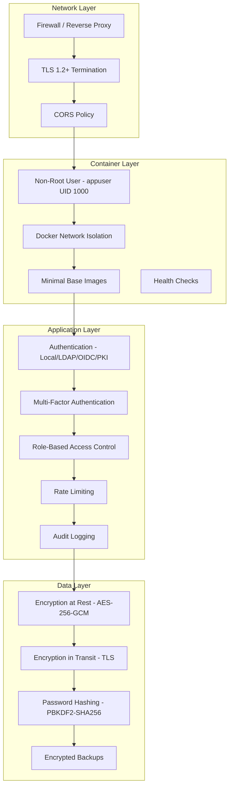

# Security Hardening

This guide covers security best practices for production OpenTranscribe deployments, including authentication hardening, network security, data protection, and compliance considerations.

## Security Architecture



## Security Checklist

Use this checklist before deploying to production.

### Pre-Deployment

- [ ] Change all default passwords (database, MinIO, Redis, admin account)
- [ ] Generate a strong `JWT_SECRET_KEY` (minimum 64 characters): `openssl rand -hex 64`
- [ ] Generate a strong `ENCRYPTION_KEY`: `openssl rand -hex 32`

:::tip
The installer (`setup-opentranscribe.sh`) generates all of these automatically on fresh
install, including the MinIO encryption key. The items above only need manual attention if you
created `.env` by hand from `.env.example` — the backend refuses to start in production mode
if placeholder keys are detected.
:::
- [ ] Set `DEBUG=false` in `.env`
- [ ] Configure TLS certificates for HTTPS
- [ ] Review and restrict CORS origins (`CORS_ORIGINS`)
- [ ] Set `ALLOWED_HOSTS` to your domain(s)
- [ ] Remove or restrict API documentation endpoint (`/docs`) in production

### Authentication

- [ ] Enable MFA enforcement for admin accounts (at minimum)
- [ ] Configure password policy (minimum 12 characters, complexity requirements)
- [ ] Set account lockout threshold (recommended: 5 failed attempts)
- [ ] Configure session timeout (recommended: 30 minutes for sensitive environments)
- [ ] Enable audit logging

### Infrastructure

- [ ] Restrict exposed ports to only what is necessary (typically 443 only)
- [ ] Configure firewall rules for Docker networks
- [ ] Enable container health checks
- [ ] Set up log aggregation and monitoring
- [ ] Schedule regular backups with encryption
- [ ] Plan credential rotation schedule

## Authentication Hardening

### MFA Enforcement

OpenTranscribe supports TOTP-based multi-factor authentication compatible with standard authenticator apps (Google Authenticator, Microsoft Authenticator, Authy).

**Configuration options:**

| Setting | Description | Recommended |
|---------|-------------|-------------|
| MFA required for all users | Every user must enroll in MFA | High-security environments |
| MFA required for admins only | Only admin-role users must enroll | Standard deployments |
| MFA optional | Users can opt in | Development only |

Configure in **Admin > Settings > Authentication > MFA Policy**.

Backup codes are generated during enrollment (8-character alphanumeric, XXXX-XXXX format). They are stored hashed with PBKDF2-SHA256 and are single-use.

### Password Policies

Configure password requirements to match your organization's security standards:

```bash
# .env configuration
PASSWORD_MIN_LENGTH=12              # Minimum password length
PASSWORD_REQUIRE_UPPERCASE=true     # Require uppercase letter
PASSWORD_REQUIRE_LOWERCASE=true     # Require lowercase letter
PASSWORD_REQUIRE_DIGIT=true         # Require number
PASSWORD_REQUIRE_SPECIAL=true       # Require special character
PASSWORD_HISTORY_COUNT=12           # Prevent reuse of last N passwords
PASSWORD_EXPIRY_DAYS=90             # Force password change (0 = disabled)
```

Passwords are hashed using bcrypt with SHA-256 pre-hash (overcomes bcrypt's 72-byte limit). For FIPS environments, PBKDF2-SHA256 with 600,000 iterations is used instead.

### Account Lockout

Protects against brute-force attacks:

```bash
ACCOUNT_LOCKOUT_THRESHOLD=5         # Lock after N failed attempts
ACCOUNT_LOCKOUT_DURATION=900        # Lockout duration in seconds (15 min)
ACCOUNT_LOCKOUT_RESET_AFTER=1800    # Reset counter after N seconds (30 min)
```

Lockout events are recorded in the audit log. Administrators can manually unlock accounts through the admin panel.

### Session Management

- **Access tokens**: Short-lived JWT tokens (configurable, default 15 minutes)
- **Refresh tokens**: Rotated on each use, preventing token replay
- **Session invalidation**: All sessions terminated on password change
- **Concurrent sessions**: Optionally limit active sessions per user

## Network Security

### Port Exposure

In production, expose only the minimum required ports:

| Port | Service | Exposure |
|------|---------|----------|
| 443 | NGINX (HTTPS) | Public |
| 80 | NGINX (HTTP redirect) | Public (redirect to 443 only) |
| 5432 | PostgreSQL | Internal only |
| 6379 | Redis | Internal only |
| 9000/9001 | MinIO | Internal only |
| 9200 | OpenSearch | Internal only |

All internal services should be accessible only through Docker's internal network, not bound to the host.

### Docker Network Isolation

OpenTranscribe uses Docker networks to isolate services. In production, ensure:

```yaml
# docker-compose.prod.yml - services should NOT expose ports to host
services:
  postgres:
    # Remove "ports:" mapping in production
    # Access only through Docker network
  redis:
    # Remove "ports:" mapping in production
  opensearch:
    # Remove "ports:" mapping in production
```

### LLM Firewall (Self-Hosted Models)

When running vLLM or Ollama on the host machine, Docker containers need firewall rules to reach the LLM server.

**Restrictive approach -- allow only Docker containers:**

```bash
# Allow vLLM only from Docker network
sudo ufw allow from 172.17.0.0/16 to any port 8000 proto tcp comment 'vLLM from Docker'

# Allow Ollama only from Docker network
sudo ufw allow from 172.17.0.0/16 to any port 11434 proto tcp comment 'Ollama from Docker'
```

**Alternative -- use Docker bridge IP in configuration:**

Instead of `localhost`, configure the LLM endpoint as:
- `http://172.17.0.1:8000/v1` (Docker bridge gateway on Linux)
- `http://host.docker.internal:8000/v1` (Docker Desktop on macOS/Windows)

Or add `extra_hosts` to relevant services in `docker-compose.yml`:

```yaml
services:
  backend:
    extra_hosts:
      - host.docker.internal:host-gateway
  celery-nlp-worker:
    extra_hosts:
      - host.docker.internal:host-gateway
```

:::tip
Both the `backend` and `celery-nlp-worker` containers need access to the LLM server. The Settings UI test runs from `backend`, but actual summarization runs from `celery-nlp-worker`.
:::

### TLS Configuration

For production deployments with NGINX:

```bash
# Start with TLS (production mode with NGINX)
./opentr.sh start prod --with-pki
```

Ensure TLS certificates are:
- From a trusted CA (not self-signed) for public deployments
- Renewed before expiration (automate with certbot or similar)
- Using TLS 1.2 or higher (TLS 1.0 and 1.1 should be disabled)

## Data Protection

### Where Your Data Lives

Transcripts and personal data exist in **several places**, not just the database. An at-rest
encryption strategy must cover all of them:

| Store | Sensitive content | At-rest encryption |
|---|---|---|
| **PostgreSQL** | Transcript text, summaries, speaker names, user emails | No native encryption — use volume/disk encryption (below) |
| **OpenSearch** | Full transcript text (search index) + embeddings | No native encryption — use volume/disk encryption (below) |
| **MinIO** | Original media files, exports, thumbnails | **AES-256-GCM server-side encryption, enabled by default** |
| **Redis** | In-flight task payloads, notifications | Volume/disk encryption (if persistence enabled) |
| **Backups** | Complete database dump (all transcripts) | `./opentr.sh backup --encrypt` (GPG AES-256) |

### Encryption at Rest

**MinIO Storage** (media files): Server-side AES-256-GCM encryption is **enabled automatically
by the installer**, which generates `MINIO_KMS_SECRET_KEY` and sets
`MINIO_KMS_AUTO_ENCRYPTION=on`. Manual configuration:

```bash
# .env configuration
MINIO_KMS_SECRET_KEY=opentranscribe-key:$(openssl rand -base64 32)
MINIO_KMS_AUTO_ENCRYPTION=on
```

**Database fields**: Sensitive fields (API keys, TOTP secrets, LLM provider credentials,
watch-source passwords) are encrypted at the application layer using AES-256-GCM with:
- 256-bit key derived via PBKDF2-SHA256 (600k iterations)
- 96-bit random nonce per encryption
- 128-bit authentication tag

Data format: `v3:base64(salt):base64(nonce):base64(ciphertext+tag)`

**PostgreSQL and OpenSearch data directories**: Vanilla PostgreSQL and OpenSearch have **no
built-in at-rest encryption**. The standard approach is encrypting the storage layer beneath
them:

- **Full-disk encryption**: LUKS/dm-crypt on the host (or FileVault on macOS, BitLocker on
  Windows). Protects against stolen or improperly decommissioned disks; transparent to Docker.
- **Encrypted volumes**: Place the Docker volume directories (`POSTGRES_DATA_PATH`,
  `OPENSEARCH_DATA_PATH`, etc.) on an encrypted filesystem or encrypted block device.
- **Cloud block storage**: If running on cloud VMs, enable the provider's volume encryption
  (e.g., encrypted EBS).

Note: transcript *text* in PostgreSQL/OpenSearch is intentionally **not** encrypted at the
application layer — full-text search, semantic search, and LLM features require the backend to
read it. Access is protected by authentication, per-user authorization on every query, and
audit logging. For masking PII/profanity at display and export time, see
[Content Redaction](../features/content-redaction.md).

### Encryption in Transit

All inter-service communication should use TLS in production:

- **Client to NGINX**: TLS 1.2+ (configured in NGINX)
- **NGINX to backend**: Internal Docker network (trusted)
- **Backend to PostgreSQL**: Enable `sslmode=require` in database connection string
- **Backend to MinIO**: Configure MinIO with TLS certificates
- **Backend to OpenSearch**: Enable HTTPS for OpenSearch

### Backup Encryption

Database backups contain **every user's transcripts in plaintext SQL**. Encrypt any backup
that leaves the host:

```bash
# Encrypted backup - pg_dump is piped directly into GPG (AES-256);
# the plaintext dump never touches disk. Prompts for a passphrase.
./opentr.sh backup --encrypt

# Restore - .gpg files are detected and decrypted automatically
./opentr.sh restore backups/opentranscribe_backup_YYYYMMDD_HHMMSS.sql.gpg
```

Store the passphrase in a password manager — an encrypted backup without its passphrase is
unrecoverable.

## API Security

### Rate Limiting

Authentication endpoints are rate-limited to prevent brute-force attacks:

| Endpoint | Limit | Scope |
|----------|-------|-------|
| Login | Configurable | Per-IP and per-user |
| Registration | Configurable | Per-IP |
| Password Reset | Configurable | Per-IP |
| API endpoints | Configurable | Per-user token |

### CORS Configuration

Restrict origins to your domain(s):

```bash
# .env - only allow your domain
CORS_ORIGINS=https://transcribe.yourdomain.com
```

Never use `*` (wildcard) in production.

### Content Security Policy

When using NGINX in production, configure CSP headers:

```nginx
add_header Content-Security-Policy "default-src 'self'; script-src 'self'; style-src 'self' 'unsafe-inline'; img-src 'self' data: blob:; connect-src 'self' wss:; media-src 'self' blob:;" always;
add_header X-Frame-Options DENY always;
add_header X-Content-Type-Options nosniff always;
add_header Referrer-Policy strict-origin-when-cross-origin always;
```

### Input Validation

OpenTranscribe validates all inputs through Pydantic schemas on the backend. File uploads are validated for:
- File type (allowed MIME types only)
- File size (configurable maximum, default 15GB)
- Filename sanitization

## Container Security

### Non-Root Execution

All backend containers run as `appuser` (UID 1000, GID 1000), not root:

- Reduces impact of container escape vulnerabilities
- Compliant with security scanning tools (Trivy, Snyk)
- User groups: `appuser`, `video` (for GPU access)

If you encounter permission issues with model cache directories:

```bash
./scripts/fix-model-permissions.sh
```

### Image Security

- **Multi-stage builds**: Production images use multi-stage Dockerfiles to minimize attack surface
- **Minimal base images**: Only necessary runtime dependencies are included
- **No secrets in images**: All secrets are passed via environment variables or mounted files
- **Regular updates**: Base images should be rebuilt periodically to pick up security patches

### Image Scanning

Scan images before deployment:

```bash
# Using Trivy
trivy image davidamacey/opentranscribe-backend:latest
trivy image davidamacey/opentranscribe-frontend:latest

# Using Docker Scout
docker scout cves davidamacey/opentranscribe-backend:latest
```

## Audit and Compliance

### Audit Logging

All authentication events are logged for security monitoring:

- Login attempts (success and failure) with IP address
- Password changes and resets
- MFA enrollment and removal
- Account lockouts and unlocks
- Session creation and termination
- Administrative actions (user management, settings changes)

Log format supports integration with SIEM systems (Splunk, ELK, etc.).

### Log Retention

Configure log retention based on your compliance requirements:

| Compliance Framework | Minimum Retention |
|---------------------|-------------------|
| SOC 2 | 1 year |
| HIPAA | 6 years |
| FedRAMP | 3 years |
| GDPR | As needed for purpose |

### FedRAMP/NIST Controls Mapping

OpenTranscribe includes features that map to NIST 800-53 controls:

| Control | Implementation |
|---------|---------------|
| **AC-2** (Account Management) | User management, role assignment, account disable |
| **AC-7** (Unsuccessful Login Attempts) | Account lockout after configurable threshold |
| **AC-8** (System Use Notification) | Classification banners (UNCLASSIFIED, CUI, SECRET, TOP SECRET) |
| **AC-12** (Session Termination) | Configurable session timeouts, auto-logout on inactivity |
| **AU-2/AU-3** (Audit Events) | Comprehensive audit logging with timestamps and source IPs |
| **IA-2** (Identification and Authentication) | Multi-factor authentication, PKI/CAC support |
| **IA-5** (Authenticator Management) | Password complexity, history, expiration policies |
| **SC-12** (Cryptographic Key Establishment) | PBKDF2 key derivation |
| **SC-13** (Cryptographic Protection) | AES-256-GCM at rest, HMAC-SHA-256 (HS256) JWT signing -- both FIPS-approved; see [Algorithm Requirements](#algorithm-requirements) |
| **SC-28** (Protection of Information at Rest) | Encrypted sensitive data fields |

Classification banners are configurable in **Admin > Settings > System > Classification Banner**.

## Secrets Management

### Protecting the .env File

The `.env` file contains all sensitive configuration. Protect it:

```bash
# Restrict file permissions
chmod 600 .env
chown root:root .env

# Never commit to version control
# (.env is in .gitignore by default)
```

### Credential Rotation

Establish a rotation schedule for all credentials:

| Credential | Rotation Frequency | How to Rotate |
|-----------|-------------------|---------------|
| `JWT_SECRET` | 90 days | Update in `.env`, restart backend (invalidates all sessions) |
| `ENCRYPTION_KEY` | Annually | Update in `.env`, existing data auto-re-encrypted on access |
| Database password | 90 days | Update in PostgreSQL and `.env`, restart all services |
| MinIO credentials | 90 days | Update in MinIO and `.env`, restart all services |
| LLM API keys | Per provider policy | Update in **Settings > AI > LLM Provider** |

### Avoiding Secrets in Logs

OpenTranscribe redacts sensitive values from log output. When adding custom integrations, never log:
- API keys or tokens
- Passwords or password hashes
- Encryption keys
- User session tokens
- TOTP secrets or backup codes

## FIPS 140-3 Compliance

For government and high-security deployments, OpenTranscribe supports FIPS 140-3 compliant cryptographic operations.

### Enabling FIPS Mode

```bash
# .env configuration
FIPS_MODE=true                      # THE master switch -- nothing below takes effect without it
FIPS_VERSION=140-3
PBKDF2_ITERATIONS_V3=600000        # NIST SP 800-132 2024 recommendation
ENCRYPTION_ALGORITHM_V3=AES-256-GCM # Authenticated encryption
FIPS_MIGRATION_MODE=compatible      # Accept both old and new formats during transition
FIPS_VALIDATE_ENTROPY=true          # Validate entropy sources
```

:::caution `FIPS_MODE` is the switch, not `FIPS_VERSION`
`FIPS_VERSION` defaults to `140-3` on **every** deployment, so a condition that reads it
alone can never be false. Every gate in the codebase therefore goes through one property,
`settings.fips_140_3_active` (= `FIPS_MODE and FIPS_VERSION == "140-3"`), and
`tests/unit/test_jwt_algorithm_single_owner.py` fails the build if a module reads
`FIPS_VERSION` directly. Set `FIPS_MODE=true`.
:::

:::caution `ENCRYPTION_ALGORITHM_V3` is validated, not dispatched on
`AES-256-GCM` is the only value this build implements, and it is not selectable. The v3
ciphertext envelope (`v3:salt:nonce:ciphertext`) records **no algorithm field**, so decrypt
has to use exactly the algorithm encrypt used — switching would make every stored provider
key, TOTP secret and credential undecryptable. Naming any other algorithm therefore makes a
FIPS deployment **refuse to start**, rather than silently encrypt with something other than
what you configured.

`FIPS_VALIDATE_ENTROPY=true` (the default) makes that same startup check verify the OS
CSPRNG is usable and that `ENCRYPTION_KEY` and `JWT_SECRET_KEY` are plausibly random —
minimum length, distinct bytes, no repeated block or run, and a Shannon-entropy floor. A
failure names the offending variable and refuses the boot. Both checks are inert unless
`FIPS_MODE=true`. Generate keys with the installer or
`generate_encryption_key()`; a hand-typed passphrase will be rejected.
:::

### Algorithm Requirements

| Component | Non-FIPS default | FIPS 140-3 (`FIPS_MODE=true`) | Migration |
|-----------|------------------|-------------------------------|-----------|
| Password Hashing | bcrypt-SHA256 (cost 12) | PBKDF2-SHA256 (600k iter) | Auto-upgrade on login |
| Symmetric Encryption | AES-256-GCM | AES-256-GCM | Auto-upgrade on access |
| JWT Signing (**all** token types) | `JWT_ALGORITHM` (HS256) | `JWT_ALGORITHM` (HS256) | None needed -- see below |
| Token Hashing | SHA-512 | SHA-512 | n/a |
| MFA Backup Codes | bcrypt (cost 12) | PBKDF2-SHA256 (600k iter) | Existing bcrypt codes keep working |

#### JWT signing is HS256, and that is FIPS-approved

Access, refresh and MFA tokens are all signed with **`JWT_ALGORITHM` -- HS256 by default,
in every mode, FIPS included.** This is a compliant configuration, not a gap:

- HMAC is approved by **FIPS 198-1**, and SHA-256 by **FIPS 180-4**.
- **NIST SP 800-57 Part 1 Rev. 5** rates HMAC-SHA-256 at 128 bits of security --
  comfortably above the 112-bit minimum **SP 800-131A Rev. 2** requires through 2030 and
  beyond.

:::info Refresh tokens were HS512 until this release, on every deployment
An earlier revision of this page said FIPS mode switched JWT signing to HS512, and that
was corrected to "HS256 always" -- but **both statements were wrong about refresh
tokens**. `token_service.create_refresh_token` selected its algorithm with
`JWT_ALGORITHM_V3 if FIPS_VERSION == "140-3" else "HS256"`, and since `FIPS_VERSION`
defaults to `140-3`, *every* install -- FIPS or not -- signed refresh tokens with HS512
while its access tokens were HS256. Nothing failed visibly, because the refresh verifier
tried both algorithms.

Refresh tokens now follow `JWT_ALGORITHM` like everything else. **No action is required
and no session is signed out**: while the migration window is open (the default),
verification accepts HS256 and HS512, so refresh tokens issued before the upgrade keep
working until they expire or rotate. One behaviour improves as a side effect --
`POST /auth/logout` presented with a *refresh* token now actually revokes it, where
before the HS512 signature failed that handler's HS256-only decode and the token stayed
valid.
:::

Two functions in `app/core/security.py` own these decisions, and every issuer and
verifier delegates to them:

- **`signing_algorithm(token_type)`** -- what gets signed. Returns `settings.JWT_ALGORITHM`
  for every token type, in every FIPS mode.
- **`accepted_algorithms(token_type)`** -- what gets accepted. The signing algorithm first,
  then the other configured algorithm and the historical HS256 default while the migration
  window is open.

`accepted_algorithms` is what the request-path verifiers (`get_current_user` /
`get_optional_current_user`), the WebSocket and SAML verifier (`verify_token`) and the
refresh verifier all call, so acceptance can no longer be wider in one and narrower in
another. It previously could: under `FIPS_MIGRATION_MODE=strict` the WebSocket verifier
accepted only `JWT_ALGORITHM_V3`, which **no issuer in the codebase mints**, so a strict
deployment authenticated HTTP requests normally and refused every WebSocket handshake.

If your authorising official requires HS512 specifically, set it explicitly:

```bash
JWT_ALGORITHM=HS512
JWT_SECRET_KEY=<at least 64 bytes>   # HS512 needs a 512-bit key; startup warns if shorter
```

That one setting moves issuance and verification together, for all three token types.
While `FIPS_MIGRATION_MODE=compatible`, HS256 tokens issued before the change stay
verifiable, so a rolling restart does not sign anyone out; `strict` closes that window.

### Migration Process

1. **Set `FIPS_MIGRATION_MODE=compatible`** -- accepts both legacy and FIPS 140-3 formats
2. **Restart services** -- `./opentr.sh restart-backend`
3. **Monitor migration** -- users are upgraded automatically on next login. Token-algorithm
   fallbacks are audited as `legacy_algorithm_fallback` (with the algorithm actually used
   and the one now expected), which is how you know the window can be closed
4. **Switch to strict mode** when all users have been upgraded: `FIPS_MIGRATION_MODE=strict`

:::warning What `strict` means, and what it does not
`strict` narrows acceptance to **exactly the algorithm this deployment signs with** --
i.e. it closes the migration window. It does **not** mean "HS512 only": a deployment left
at the default `JWT_ALGORITHM=HS256` signs HS256, so strict accepts HS256 and refuses
HS512. Refusing what you issue is an outage, not a hardening.

So `strict` only refuses something once you have *also* set `JWT_ALGORITHM=HS512`. Turning
it on invalidates every token signed with the other algorithm immediately -- including
refresh tokens, which means active sessions must re-authenticate rather than refresh. Do
it in a maintenance window, after step 3 shows no more fallbacks.
:::

### TOTP Compatibility

TOTP uses SHA-1 by default per RFC 6238. This is FIPS-allowed because NIST SP 800-131A Rev. 2 permits SHA-1 for HMAC-based applications (SHA-1's collision weakness does not affect HMAC security). This ensures compatibility with standard authenticator apps.

For environments requiring SHA-256/SHA-512 TOTP (with compatible authenticator apps):

```bash
TOTP_ALGORITHM=SHA256  # or SHA512
```

### Verification

Run the compliance verification script:

```bash
./scripts/verify-fips-140-3.sh
```

This checks password hashing algorithm and iterations, JWT signing algorithm, encryption algorithm, and token hash algorithm.

## Vulnerability Reporting

If you discover a security vulnerability in OpenTranscribe:

1. **Do NOT** create a public GitHub issue
2. Email security concerns to the project maintainers (see the repository's SECURITY.md for contact information)
3. Include: description of the vulnerability, steps to reproduce, potential impact, and suggested fixes if any

### Response Timeline

| Severity | Initial Response | Target Fix |
|----------|-----------------|-----------|
| Critical | 24-48 hours | 7 days |
| High | 72 hours | 14 days |
| Medium/Low | 1 week | 30 days |

The project follows responsible disclosure practices and will credit researchers (with permission) in security advisories.
