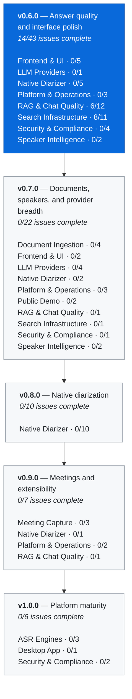

# Roadmap

Every item below is a real GitHub issue. **This page is generated from the issue tracker** — it cannot describe work that is not tracked, and it cannot go stale while an issue moves.

- **Source of truth:** the [project board](https://github.com/orgs/attevon-llc/projects/1) and the issues it contains
- **Grouping:** each issue carries exactly one `epic:*` label
- **Version:** the issue's GitHub milestone
- **Progress:** open vs. closed issue counts, not estimates

:::note[Dates are sequence, not commitment]

Versions are ordered by dependency. A later version is not scheduled for a date — it is blocked on the one before it. Scope moves between versions as work is understood; that is expected, not drift.

:::

## Release flow



## v0.6.0 — Answer quality and interface polish

Makes what already ships correct: RAG answers that cite what they used, searchable summaries, an interface pass, and the security and data-integrity fixes that affect running deployments today.

**14 of 43 issues complete.**

### Frontend & UI · 0/5

_SPA surfaces, admin screens, and UI defect fixes_

| | Issue |
|---|---|
| ◻️ | [#569](https://github.com/attevon-llc/OpenTranscribe/issues/569) feat(frontend): wire persistent download notifications into the live notification bell |
| ◻️ | [#570](https://github.com/attevon-llc/OpenTranscribe/issues/570) feat(admin): expose locked-account management (view/reset) in the admin UI |
| ◻️ | [#576](https://github.com/attevon-llc/OpenTranscribe/issues/576) feat(admin): quarantine/takedown has no UI — admin must curl 3 backend-only endpoints |
| ◻️ | [#649](https://github.com/attevon-llc/OpenTranscribe/issues/649) Audit other interactive UI paths for the same premature-interaction timing bug class as #645 |
| ◻️ | [#682](https://github.com/attevon-llc/OpenTranscribe/issues/682) fix(frontend): UI bug backlog for the v0.6.0 UI refresh (filters, modal styling, button states) |

Browse: [`epic:frontend-ui`](https://github.com/attevon-llc/OpenTranscribe/labels/epic%3Afrontend-ui)

### LLM Providers · 0/1

_Provider integrations and provider-config UX_

| | Issue |
|---|---|
| ◻️ | [#644](https://github.com/attevon-llc/OpenTranscribe/issues/644) Admin LLM provider setup: surface discoverable local base URLs instead of requiring manual Docker hostname entry |

Browse: [`epic:llm-providers`](https://github.com/attevon-llc/OpenTranscribe/labels/epic%3Allm-providers)

### Native Diarizer · 0/5

_Rust/ONNX diarization; retiring PyTorch/PyAnnote_

| | Issue |
|---|---|
| ◻️ | [#655](https://github.com/attevon-llc/OpenTranscribe/issues/655) bug(docker): diar-native sidecar is unwired in gpu-scale, gpu-split, lite, offline, Windows, --fresh and CPU-only topologies |
| ◻️ | [#662](https://github.com/attevon-llc/OpenTranscribe/issues/662) bug(config): .env.example ships DIAR_NATIVE_GPU=0, restoring the bare-device-0 pin the compose comment exists to prevent |
| ◻️ | [#665](https://github.com/attevon-llc/OpenTranscribe/issues/665) fix(gpu): overlap-diarization gate keys off the configured backend, not sidecar reachability — transcriber is never released on the PyAnnote fallback path |
| ◻️ | [#671](https://github.com/attevon-llc/OpenTranscribe/issues/671) docs(backend): transcription/ and services/diarization/ CLAUDE.md still describe PyAnnote as the engine |
| ◻️ | [#672](https://github.com/attevon-llc/OpenTranscribe/issues/672) bug(config): PYANNOTE_MODEL means two different things, the admin panel misreports the diarizer, and four diarizer symbols are dead |

Browse: [`epic:native-diarizer`](https://github.com/attevon-llc/OpenTranscribe/labels/epic%3Anative-diarizer)

### Platform & Operations · 0/3

_Build, deploy, workers, GPU tuning, governance_

| | Issue |
|---|---|
| ◻️ | [#631](https://github.com/attevon-llc/OpenTranscribe/issues/631) Celery prefork pool death spiral: 10h46m of forked children failing to signal UP, root cause unknown |
| ◻️ | [#680](https://github.com/attevon-llc/OpenTranscribe/issues/680) bug(docker): the published arm64 backend image is not equivalent to amd64 — 765 MB vs 4,454 MB, dependency layer 8.4x smaller |
| ◻️ | [#681](https://github.com/attevon-llc/OpenTranscribe/issues/681) bug(ci-cd): an unscannable component yields "All security scans completed successfully!" — docs is already in this state |

Browse: [`epic:platform-ops`](https://github.com/attevon-llc/OpenTranscribe/labels/epic%3Aplatform-ops)

### RAG & Chat Quality · 6/12

_Retrieval, grounding, citations, summary search_

| | Issue |
|---|---|
| ✅ | [#362](https://github.com/attevon-llc/OpenTranscribe/issues/362) feat: Document ingestion & knowledge base — parse, index, and chat over documents alongside transcripts |
| ✅ | [#383](https://github.com/attevon-llc/OpenTranscribe/issues/383) feat(chat): corpus-scale RAG — summary tier, query routing, aggregation, model-tier parity, and a real eval harness |
| ✅ | [#403](https://github.com/attevon-llc/OpenTranscribe/issues/403) feat(rag): master orchestrator — ordered end-to-end implementation of corpus-scale RAG, retrieval tuning, and documents (#383 → #363 → #362) |
| ✅ | [#461](https://github.com/attevon-llc/OpenTranscribe/issues/461) RAG retrieval quality: what is measured, what is not, and what to do next |
| ◻️ | [#462](https://github.com/attevon-llc/OpenTranscribe/issues/462) feat(search): make AI summaries searchable and citable in the search page |
| ✅ | [#463](https://github.com/attevon-llc/OpenTranscribe/issues/463) eval: measure whether chat answers are actually useful — QMSum reference answers are already on disk and unused |
| ◻️ | [#464](https://github.com/attevon-llc/OpenTranscribe/issues/464) feat(rag-chat): use LLM summaries as the map output when an LLM is configured (tiered tree_summarize) |
| ✅ | [#465](https://github.com/attevon-llc/OpenTranscribe/issues/465) AI summaries are displayed and exported completely unmasked, ignoring the user's redaction policy |
| ◻️ | [#506](https://github.com/attevon-llc/OpenTranscribe/issues/506) task(rag-chat): measure dropping the stemmed BM25 leg for non-English queries (deferred from #453) |
| ◻️ | [#523](https://github.com/attevon-llc/OpenTranscribe/issues/523) task(rag-chat): short speaker turns become content-free chunks — route speaker questions, expand context at read time |
| ◻️ | [#526](https://github.com/attevon-llc/OpenTranscribe/issues/526) task(rag-chat): context expansion decouples citations from their source chunk (snippet longer than the chunk it cites) |
| ◻️ | [#532](https://github.com/attevon-llc/OpenTranscribe/issues/532) task(rag-chat): retrieval offers 99% of scope but the answer cites 75% — synthesis, not retrieval |

Browse: [`epic:rag-quality`](https://github.com/attevon-llc/OpenTranscribe/labels/epic%3Arag-quality)

### Search Infrastructure · 8/11

_OpenSearch indexing, reindex correctness, drift_

| | Issue |
|---|---|
| ✅ | [#363](https://github.com/attevon-llc/OpenTranscribe/issues/363) search: measure RRF vs score-based hybrid fusion, and record the speaker-turn chunking decision |
| ✅ | [#400](https://github.com/attevon-llc/OpenTranscribe/issues/400) fix(search): re-running search indexing never deletes existing chunks — stale tail chunks survive a shorter re-chunk |
| ✅ | [#401](https://github.com/attevon-llc/OpenTranscribe/issues/401) fix(search): ingest pipeline recreation compares only model_id — a field_map change is silently ignored on upgrade |
| ✅ | [#402](https://github.com/attevon-llc/OpenTranscribe/issues/402) chore(docs): four doc-drift fixes found during the #383/#363 second-opinion review |
| ✅ | [#405](https://github.com/attevon-llc/OpenTranscribe/issues/405) fix(search): speaker and title renames never propagate to transcript_chunks — chat speaker scope, search facets, and citations serve stale names until a full reindex |
| ✅ | [#432](https://github.com/attevon-llc/OpenTranscribe/issues/432) fix(search): six more display_name writers still leave stale speaker names in transcript_chunks |
| ✅ | [#435](https://github.com/attevon-llc/OpenTranscribe/issues/435) fix(search): chunk-prune count gate reads the searcher, so a re-index inside the refresh window leaks orphans permanently |
| ✅ | [#437](https://github.com/attevon-llc/OpenTranscribe/issues/437) fix(search): switching the embedding model silently leaves a mixed-vector index, and embedding_model records the mode not the model |
| ◻️ | [#627](https://github.com/attevon-llc/OpenTranscribe/issues/627) fix(search): admin "Reindex all" only re-indexes the admin's own files, not the whole corpus |
| ◻️ | [#658](https://github.com/attevon-llc/OpenTranscribe/issues/658) bug(operations): speaker voiceprints live only in OpenSearch and no backup covers them |
| ◻️ | [#666](https://github.com/attevon-llc/OpenTranscribe/issues/666) fix(search): a transcript text edit never reindexes OpenSearch — search, RAG retrieval and citations serve pre-edit text indefinitely |

Browse: [`epic:search-infra`](https://github.com/attevon-llc/OpenTranscribe/labels/epic%3Asearch-infra)

### Security & Compliance · 0/4

_Hardening, data protection, certification work_

| | Issue |
|---|---|
| ◻️ | [#664](https://github.com/attevon-llc/OpenTranscribe/issues/664) fix(security): retention sweep and purge_media_file have no legal_hold guard — a legal-held file can be permanently deleted |
| ◻️ | [#668](https://github.com/attevon-llc/OpenTranscribe/issues/668) security(deploy): nginx/reverse-proxy hardening — trusted-proxy rate-limit collapse, pre-auth body buffering, missing robots.txt |
| ◻️ | [#673](https://github.com/attevon-llc/OpenTranscribe/issues/673) fix(redaction): export_locked is enforced only for subtitles — the admin forced-redacted-export policy is bypassable via every other export format |
| ◻️ | [#676](https://github.com/attevon-llc/OpenTranscribe/issues/676) security(api): LLM connection-test and model-discovery handlers make user-supplied outbound requests with no rate limit |

Browse: [`epic:compliance`](https://github.com/attevon-llc/OpenTranscribe/labels/epic%3Acompliance)

### Speaker Intelligence · 0/2

_Voiceprint matching, personas, cross-file identity_

| | Issue |
|---|---|
| ◻️ | [#674](https://github.com/attevon-llc/OpenTranscribe/issues/674) fix(speakers): auto-accept threshold is passed as OpenSearch min_score in cosinesimil space — the effective gate is raw cosine 0.50, not 0.75 |
| ◻️ | [#675](https://github.com/attevon-llc/OpenTranscribe/issues/675) fix(search): speaker profile rename never propagates to transcript_chunks — the one rename path that skips dispatch_speaker_rename |

Browse: [`epic:speaker-persona`](https://github.com/attevon-llc/OpenTranscribe/labels/epic%3Aspeaker-persona)

## v0.7.0 — Documents, speakers, and provider breadth

Widens the library beyond audio, deepens cross-file speaker identity, and adds the LLM providers and pipeline efficiency work that the quality release depends on but does not block.

**0 of 22 issues complete.**

### Document Ingestion · 0/4

_Non-audio documents as first-class library items_

| | Issue |
|---|---|
| ◻️ | [#516](https://github.com/attevon-llc/OpenTranscribe/issues/516) feat(documents): unified gallery with type filter, uniform status, recovery and takedown parity |
| ◻️ | [#546](https://github.com/attevon-llc/OpenTranscribe/issues/546) fix(documents): Document.file_hash is written by both ingest paths and read by neither |
| ◻️ | [#547](https://github.com/attevon-llc/OpenTranscribe/issues/547) fix(documents): watch-imported documents are unrepresentable in the watch-source API (no document_uuid; two statuses missing from the enums) |
| ◻️ | [#552](https://github.com/attevon-llc/OpenTranscribe/issues/552) task(documents): re-land the document-ingestion vertical from feat/doc-ingestion for v0.6.0 |

Browse: [`epic:document-ingestion`](https://github.com/attevon-llc/OpenTranscribe/labels/epic%3Adocument-ingestion)

### Frontend & UI · 0/2

_SPA surfaces, admin screens, and UI defect fixes_

| | Issue |
|---|---|
| ◻️ | [#20](https://github.com/attevon-llc/OpenTranscribe/issues/20) feat(analytics): add analytics dashboard to gallery view |
| ◻️ | [#564](https://github.com/attevon-llc/OpenTranscribe/issues/564) feat(export): Markdown-file export format |

Browse: [`epic:frontend-ui`](https://github.com/attevon-llc/OpenTranscribe/labels/epic%3Afrontend-ui)

### LLM Providers · 0/4

_Provider integrations and provider-config UX_

| | Issue |
|---|---|
| ◻️ | [#378](https://github.com/attevon-llc/OpenTranscribe/issues/378) feat(llm): Add Tinfoil confidential-computing LLM provider |
| ◻️ | [#379](https://github.com/attevon-llc/OpenTranscribe/issues/379) feat(llm): Add Google Gemini as a first-class LLM provider |
| ◻️ | [#380](https://github.com/attevon-llc/OpenTranscribe/issues/380) feat(llm): Add Groq as a first-class LLM provider (low-latency inference) |
| ◻️ | [#382](https://github.com/attevon-llc/OpenTranscribe/issues/382) feat(llm): Add GCP Vertex AI as an SDK-based enterprise LLM provider (Bedrock-style) |

Browse: [`epic:llm-providers`](https://github.com/attevon-llc/OpenTranscribe/labels/epic%3Allm-providers)

### Native Diarizer · 0/2

_Rust/ONNX diarization; retiring PyTorch/PyAnnote_

| | Issue |
|---|---|
| ◻️ | [#661](https://github.com/attevon-llc/OpenTranscribe/issues/661) perf(pipeline): collapse the audio handoff — four decodes and ~2.1 GB of one signal per job |
| ◻️ | [#679](https://github.com/attevon-llc/OpenTranscribe/issues/679) Adopt diar-native 0.3.0: self-provisioning models, CPU/GPU routing, /readyz, and structured logs |

Browse: [`epic:native-diarizer`](https://github.com/attevon-llc/OpenTranscribe/labels/epic%3Anative-diarizer)

### Platform & Operations · 0/3

_Build, deploy, workers, GPU tuning, governance_

| | Issue |
|---|---|
| ◻️ | [#369](https://github.com/attevon-llc/OpenTranscribe/issues/369) perf(gpu): calibrate transcriber eviction + concurrency from measurement, not magic numbers (limited-VRAM cards) |
| ◻️ | [#468](https://github.com/attevon-llc/OpenTranscribe/issues/468) task(governance): set up Contributor License Agreement (CLA) enforcement |
| ◻️ | [#566](https://github.com/attevon-llc/OpenTranscribe/issues/566) task(config): move UI-worthy env vars into the admin UI, then drop them from .env.example |

Browse: [`epic:platform-ops`](https://github.com/attevon-llc/OpenTranscribe/labels/epic%3Aplatform-ops)

### Public Demo · 0/2

_Read-only hosted demo deployment_

| | Issue |
|---|---|
| ◻️ | [#628](https://github.com/attevon-llc/OpenTranscribe/issues/628) feat(deploy): public read-only demo deployment (Immich-style inert demo instance) |
| ◻️ | [#667](https://github.com/attevon-llc/OpenTranscribe/issues/667) build(release): publish the CPU-only lite image as a multi-arch (amd64 + arm64) release artifact |

Browse: [`epic:public-demo`](https://github.com/attevon-llc/OpenTranscribe/labels/epic%3Apublic-demo)

### RAG & Chat Quality · 0/1

_Retrieval, grounding, citations, summary search_

| | Issue |
|---|---|
| ◻️ | [#562](https://github.com/attevon-llc/OpenTranscribe/issues/562) feat(llm): custom note templates per meeting type (standup/1:1/interview) |

Browse: [`epic:rag-quality`](https://github.com/attevon-llc/OpenTranscribe/labels/epic%3Arag-quality)

### Search Infrastructure · 0/1

_OpenSearch indexing, reindex correctness, drift_

| | Issue |
|---|---|
| ◻️ | [#46](https://github.com/attevon-llc/OpenTranscribe/issues/46) feat(transcript): transcript version control and change tracking |

Browse: [`epic:search-infra`](https://github.com/attevon-llc/OpenTranscribe/labels/epic%3Asearch-infra)

### Security & Compliance · 0/1

_Hardening, data protection, certification work_

| | Issue |
|---|---|
| ◻️ | [#559](https://github.com/attevon-llc/OpenTranscribe/issues/559) security(dependencies): evaluate replacing Perl exiftool (16 of 20 CRITICAL CVEs) — ffprobe-only vs exiftool-rs |

Browse: [`epic:compliance`](https://github.com/attevon-llc/OpenTranscribe/labels/epic%3Acompliance)

### Speaker Intelligence · 0/2

_Voiceprint matching, personas, cross-file identity_

| | Issue |
|---|---|
| ◻️ | [#550](https://github.com/attevon-llc/OpenTranscribe/issues/550) feat(speakers): Speaker Persona Profiles — corpus-level speech, topic and role profiles grounded in deterministic conversation metrics |
| ◻️ | [#624](https://github.com/attevon-llc/OpenTranscribe/issues/624) task(speakers): profile speaker-matching kNN performance at scale + add a decision-parity fixture |

Browse: [`epic:speaker-persona`](https://github.com/attevon-llc/OpenTranscribe/labels/epic%3Aspeaker-persona)

## v0.8.0 — Native diarization

Retires the in-process PyTorch/PyAnnote diarizer in favour of the native Rust/ONNX engine, including the voiceprint migration and the deployment and test coverage that has to exist first.

**0 of 10 issues complete.**

### Native Diarizer · 0/10

_Rust/ONNX diarization; retiring PyTorch/PyAnnote_

| | Issue |
|---|---|
| ◻️ | [#572](https://github.com/attevon-llc/OpenTranscribe/issues/572) task(asr): roadmap for removing PyTorch/PyAnnote diarization once native diar-native has parity |
| ◻️ | [#639](https://github.com/attevon-llc/OpenTranscribe/issues/639) Diarization backend defaults to native (diar-native sidecar) but the sidecar is never distributed to self-hosted installs — perpetual silent-ish PyAnnote fallback |
| ◻️ | [#654](https://github.com/attevon-llc/OpenTranscribe/issues/654) task(models): add a download-models diar-native group — the export four files already claim exists |
| ◻️ | [#656](https://github.com/attevon-llc/OpenTranscribe/issues/656) task(asr): sidecar-unavailable retry policy, bounded timeout and status surface before the PyAnnote fallback is removed |
| ◻️ | [#657](https://github.com/attevon-llc/OpenTranscribe/issues/657) bug(search): v4 embedding migration loses profile voiceprints and crosses index dimensions mid-run |
| ◻️ | [#659](https://github.com/attevon-llc/OpenTranscribe/issues/659) feat(search): a real rollback path for the v3→v4 speaker-index alias swap |
| ◻️ | [#660](https://github.com/attevon-llc/OpenTranscribe/issues/660) task(asr): --lite adopts the diar-native CPU execution provider for speaker embeddings |
| ◻️ | [#663](https://github.com/attevon-llc/OpenTranscribe/issues/663) docs(legal): add a NOTICE file — the native diarizer's weights are CC-BY-4.0 and still require pyannote attribution |
| ◻️ | [#669](https://github.com/attevon-llc/OpenTranscribe/issues/669) task(testing): diarization test + gate coverage survives the PyAnnote removal (several would go green measuring nothing) |
| ◻️ | [#670](https://github.com/attevon-llc/OpenTranscribe/issues/670) bug(deploy): upgrading into a mandatory-sidecar release degrades silently instead of refusing |

Browse: [`epic:native-diarizer`](https://github.com/attevon-llc/OpenTranscribe/labels/epic%3Anative-diarizer)

## v0.9.0 — Meetings and extensibility

Brings meetings in automatically — calendar-aware capture and briefs — and opens the pipeline to external tooling.

**0 of 7 issues complete.**

### Meeting Capture · 0/3

_Recall.ai ingestion, calendar, pre-meeting briefs_

| | Issue |
|---|---|
| ◻️ | [#365](https://github.com/attevon-llc/OpenTranscribe/issues/365) feat(asr): Recall.ai meeting capture — ingest meetings, transcripts, speakers and metadata into the same library |
| ◻️ | [#563](https://github.com/attevon-llc/OpenTranscribe/issues/563) feat(calendar): calendar integration (foundational) |
| ◻️ | [#565](https://github.com/attevon-llc/OpenTranscribe/issues/565) feat(rag-chat): pre-meeting briefs from calendar + past transcripts |

Browse: [`epic:meeting-capture`](https://github.com/attevon-llc/OpenTranscribe/labels/epic%3Ameeting-capture)

### Native Diarizer · 0/1

_Rust/ONNX diarization; retiring PyTorch/PyAnnote_

| | Issue |
|---|---|
| ◻️ | [#511](https://github.com/attevon-llc/OpenTranscribe/issues/511) perf(gpu): build and measure a 4 GB laptop GPU tier for native diarization |

Browse: [`epic:native-diarizer`](https://github.com/attevon-llc/OpenTranscribe/labels/epic%3Anative-diarizer)

### Platform & Operations · 0/2

_Build, deploy, workers, GPU tuning, governance_

| | Issue |
|---|---|
| ◻️ | [#274](https://github.com/attevon-llc/OpenTranscribe/issues/274) build(docker): Blackwell base image upgrade (nvidia/pytorch 26.x) — needs a torchaudio strategy + hardware validation |
| ◻️ | [#561](https://github.com/attevon-llc/OpenTranscribe/issues/561) feat(backend): plugin/post-processing hook architecture for transcription pipeline |

Browse: [`epic:platform-ops`](https://github.com/attevon-llc/OpenTranscribe/labels/epic%3Aplatform-ops)

### RAG & Chat Quality · 0/1

_Retrieval, grounding, citations, summary search_

| | Issue |
|---|---|
| ◻️ | [#560](https://github.com/attevon-llc/OpenTranscribe/issues/560) feat(rag-chat): MCP server for transcript/RAG-chat access by external AI agents |

Browse: [`epic:rag-quality`](https://github.com/attevon-llc/OpenTranscribe/labels/epic%3Arag-quality)

## v1.0.0 — Platform maturity

Alternative ASR engines, a standalone desktop application, live transcription, and formal compliance validation.

**0 of 6 issues complete.**

### ASR Engines · 0/3

_Alternative and native transcription engines_

| | Issue |
|---|---|
| ◻️ | [#48](https://github.com/attevon-llc/OpenTranscribe/issues/48) feat(asr): implement native Apple Silicon transcription with MLX-Whisper or whisper.cpp |
| ◻️ | [#69](https://github.com/attevon-llc/OpenTranscribe/issues/69) feat(asr): live transcription with real-time speaker identification |
| ◻️ | [#366](https://github.com/attevon-llc/OpenTranscribe/issues/366) feat(asr): NVIDIA NeMo (Parakeet / Canary) as a first-class local transcription engine |

Browse: [`epic:asr-engines`](https://github.com/attevon-llc/OpenTranscribe/labels/epic%3Aasr-engines)

### Desktop App · 0/1

_Standalone cross-platform application_

| | Issue |
|---|---|
| ◻️ | [#283](https://github.com/attevon-llc/OpenTranscribe/issues/283) feat(desktop): cross-platform standalone desktop app (Tauri + SQLite/sqlite-vec + local inference core) |

Browse: [`epic:desktop`](https://github.com/attevon-llc/OpenTranscribe/labels/epic%3Adesktop)

### Security & Compliance · 0/2

_Hardening, data protection, certification work_

| | Issue |
|---|---|
| ◻️ | [#98](https://github.com/attevon-llc/OpenTranscribe/issues/98) security(compliance): HIPAA, SOC 2, and GDPR certification requirements |
| ◻️ | [#574](https://github.com/attevon-llc/OpenTranscribe/issues/574) task(security): achieve real FIPS 140-3/140-2 module validation (not just approved algorithms) for FedRAMP High/DoD IL4+ |

Browse: [`epic:compliance`](https://github.com/attevon-llc/OpenTranscribe/labels/epic%3Acompliance)

## (unscheduled)

**17 of 18 issues complete.**

### Native Diarizer · 1/1

_Rust/ONNX diarization; retiring PyTorch/PyAnnote_

| | Issue |
|---|---|
| ✅ | [#571](https://github.com/attevon-llc/OpenTranscribe/issues/571) task(asr): migrate CPU-lite + speaker-embedding path off PyTorch/PyAnnote onto native diar-native |

Browse: [`epic:native-diarizer`](https://github.com/attevon-llc/OpenTranscribe/labels/epic%3Anative-diarizer)

### RAG & Chat Quality · 14/14

_Retrieval, grounding, citations, summary search_

| | Issue |
|---|---|
| ✅ | [#514](https://github.com/attevon-llc/OpenTranscribe/issues/514) Live query-trace panel: an animated, Redis-pushed execution tree for search and RAG |
| ✅ | [#515](https://github.com/attevon-llc/OpenTranscribe/issues/515) Umbrella: RAG/chat/search/document-ingest completion — status, plan corrections, and open decisions |
| ✅ | [#517](https://github.com/attevon-llc/OpenTranscribe/issues/517) eval: scope coverage — the metric no framework measures, and the bug it hides |
| ✅ | [#518](https://github.com/attevon-llc/OpenTranscribe/issues/518) eval: calibrate the LLM judge with Cohen's Kappa before tuning anything on it |
| ✅ | [#519](https://github.com/attevon-llc/OpenTranscribe/issues/519) eval: acceptance suite for the four real query shapes, over AMI ground truth |
| ✅ | [#521](https://github.com/attevon-llc/OpenTranscribe/issues/521) eval: add ELITR-Bench (CC-BY-4.0) — first benchmark that tests speaker attribution directly |
| ✅ | [#524](https://github.com/attevon-llc/OpenTranscribe/issues/524) RAG: the speaker axis silently disables itself at corpus scale (roster cap declines wholesale) |
| ✅ | [#525](https://github.com/attevon-llc/OpenTranscribe/issues/525) RAG: widening the candidate pool changes nothing — ranking keeps selecting content-free fragments |
| ✅ | [#530](https://github.com/attevon-llc/OpenTranscribe/issues/530) RAG: calibrate the answer judge with Cohen's Kappa (gates every quality claim) |
| ✅ | [#531](https://github.com/attevon-llc/OpenTranscribe/issues/531) RAG: shipped 48/12/4 retrieval budget starves the chat — 2x recall available |
| ✅ | [#533](https://github.com/attevon-llc/OpenTranscribe/issues/533) LLM settings: discover a model's context window instead of defaulting to 8192 |
| ✅ | [#534](https://github.com/attevon-llc/OpenTranscribe/issues/534) RAG: validate the budget finding on a second corpus (ELITR-Bench) before changing defaults |
| ✅ | [#535](https://github.com/attevon-llc/OpenTranscribe/issues/535) RAG: standing acceptance suite over the four query shapes |
| ✅ | [#536](https://github.com/attevon-llc/OpenTranscribe/issues/536) chat: base rules leak prompt-internal block vocabulary into answers when the block is absent |

Browse: [`epic:rag-quality`](https://github.com/attevon-llc/OpenTranscribe/labels/epic%3Arag-quality)

### Security & Compliance · 1/2

_Hardening, data protection, certification work_

| | Issue |
|---|---|
| ◻️ | [#415](https://github.com/attevon-llc/OpenTranscribe/issues/415) security(dependencies): accepted risk — 16 CRITICAL perl CVEs via libimage-exiftool-perl, re-check when Debian ships fixes |
| ✅ | [#575](https://github.com/attevon-llc/OpenTranscribe/issues/575) docs(compliance): password policy (forced expiry + composition rules) contradicts current NIST SP 800-63B Rev. 4, not FedRAMP IA-5 best practice |

Browse: [`epic:compliance`](https://github.com/attevon-llc/OpenTranscribe/labels/epic%3Acompliance)

### Speaker Intelligence · 1/1

_Voiceprint matching, personas, cross-file identity_

| | Issue |
|---|---|
| ✅ | [#512](https://github.com/attevon-llc/OpenTranscribe/issues/512) feat(speakers): cross-file speaker clustering — ANN index over speaker embeddings + batch re-resolution |

Browse: [`epic:speaker-persona`](https://github.com/attevon-llc/OpenTranscribe/labels/epic%3Aspeaker-persona)

## How this page is maintained

Regenerate after any milestone or epic-label change:

```bash
python3 scripts/generate-roadmap.py
```

`--check` exits non-zero when the tracker and this page disagree, so a CI job can fail on drift rather than letting the published roadmap quietly diverge from the board.

To move an item, change its **milestone** (version) or its **`epic:*` label** (grouping) on the issue and regenerate. Editing this file by hand is pointless — the next run overwrites it.

{/* Generated 2026-09-01 by scripts/generate-roadmap.py. Do not edit. */}
