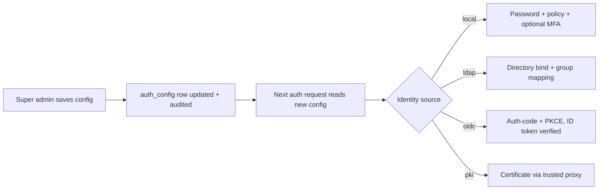
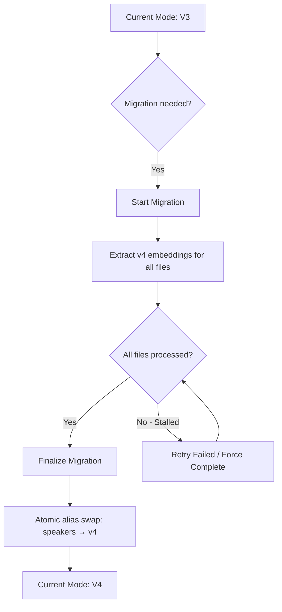

# Admin Panel

The Admin Panel provides system-wide management capabilities for OpenTranscribe administrators. It is accessible through the **Settings** modal and includes tools for user management, authentication configuration, search indexing, data integrity, and system monitoring.

## Access Requirements

The Admin Panel is role-gated. The dividing rule is:

> **Anything that changes how the deployment runs, or that stores infrastructure credentials,
> is `super_admin`. Anything that manages users and their content is `admin`.**

| Role | Access |
|------|--------|
| **User** | Profile, recording, transcription, personal settings, own MFA, own active sessions |
| **Admin** | All user sections plus user management, system statistics, task health, search & indexing, data integrity, embedding consistency/migration, retention, retry settings, and media sources |
| **Super Admin** | All admin sections plus authentication configuration, role changes, audit logs, ASR provider, engine configuration, backups, media mirror, watch sources, and the redaction policy floor |

:::warning Changed in v0.5.0
Six panels moved from `admin` to `super_admin`: **ASR provider**, **Engine configuration**,
**Backups**, **Media Mirror**, **Watch sources**, and the **Redaction policy** floor. If a plain
`admin` administers any of them today, promote that account (Settings → Users → Role) before
upgrading, or hand the work to an existing super admin.
:::

To access admin features, open **Settings** (gear icon) and scroll to the admin sections in the sidebar.

## System Statistics

The **System Statistics** section provides a real-time dashboard of your OpenTranscribe deployment.

### Metrics Displayed

- **Users** -- Total registered users and recent signups
- **Files** -- Total media files, recent uploads, total audio duration, and transcript segment count
- **Tasks** -- Pending, running, completed, and failed task counts with success rate and average processing time
- **Speakers** -- Total detected speakers and average speakers per file
- **Models** -- Active Whisper and diarization model names
- **System Resources** -- CPU usage (per-core and aggregate), memory usage, disk usage
- **GPU** -- GPU name, VRAM usage (used/total/free), GPU utilization percentage, and temperature

### GPU Monitoring

GPU statistics are collected from the Celery worker via Redis. The backend queries `nvidia-smi` on the worker and caches the results. If Redis has no cached stats, the backend attempts a direct `nvidia-smi` query or dispatches an on-demand collection task to the CPU queue.

In multi-GPU scaling mode, stats are reported per active GPU worker.

## User Management

The **Users** section manages all user accounts, pending invitations, and per-account
authentication settings.

### Inviting users

**Invite User** is the supported way to onboard when self-registration is off. You name:

- **Email**
- **Full name** (optional)
- **Role** -- `user`, `admin`, or `super_admin`
- **Auth type** -- `local`, `ldap`, `oidc`, or `pki`
- **Expiry** in hours

The invitee receives an emailed link, proves control of the address, and chooses their own
credential. For an external **auth type** no password is set at all — the account is handed to
the identity provider. Invitation tokens are hashed at rest, single-use, and expiring.

Pending invitations are listed with a pre-computed status (`pending`, `accepted`, `revoked`,
`expired`) and can be revoked.

:::note
Inviting or creating a `super_admin` raises a confirmation dialog. Invitations require a working
transactional-mail transport — see [auth email designation](#auth-email-designation) below.
:::

### Pending approvals

When a super admin turns on **Authentication → Local → Require account approval**, every newly
provisioned account — self-registered *or* created just-in-time by an external identity
provider — lands in a pending state instead of becoming usable. Administrators approve or reject
them (`GET`/`POST /api/admin/user-approvals`).

Approval is not the same as activation: deactivation revokes an account that was once usable,
approval gates one that never has been. Turning the setting off releases everything still
pending; **rejected accounts stay rejected**, and rejecting never deletes the row.

### Creating users directly

**Add User** creates an account immediately. Fields: full name, email (unique), role, **auth
type**, and — for `auth_type: local` only — a password. Choosing an external auth type omits the
password field entirely rather than storing a credential the account will never accept.

### User table

Columns for name, email, role, auth type and creation date, with badges for **inactive** and
**unverified** accounts. A search bar filters by name or email.

### Available actions

For each user (except yourself):

| Action | Description |
|--------|-------------|
| **Change role** | `user` / `admin` / **`super_admin`** — the super_admin option is visible only to a super admin, is audited, and raises a confirmation dialog |
| **Reset password** | Super admin only. Applies the password policy and the reuse history, revokes every session, and optionally flags the account for a forced change on next sign-in. Refused for an account whose identity lives in a directory |
| **Lock / unlock account** | Lock deactivates the account; unlock is its true inverse — it clears **both** the deactivation and any failed-login lockout |
| **Force logout** | Revokes every session for the account |
| **Reset MFA** | Super admin only. Clears the user's TOTP enrolment and backup codes so they can re-enrol |
| **Toggle local fallback** | Super admin only — allows an external (`pki` / `oidc`) account to also sign in with a local password. Rejected for `ldap` accounts, which never have one |
| **Recover files** | Triggers file recovery for the user |
| **Delete user** | Permanently deletes the account (confirmation required) |

:::note
You cannot change your own role or delete your own account here; your row shows "Current User".
**The last remaining super admin cannot be demoted or deleted.**
:::

## Engine Configuration

Admin-tunable, runtime-safe transcription engine settings. All changes apply live -- no worker restart required. Settings are DB-backed with environment-variable fallback.

### Diarization Boundary Correction

- **Boundary smoothing** (default **on**): collapses 1--3 word "wrong-speaker islands" at speaker turn boundaries (pure-CPU, runs at finalize)
- **Acoustic backchannel re-check** (default **off**, experimental, GPU): re-embeds short disputed/overlap words and reassigns them by voiceprint cosine
  - **Cosine margin**: minimum cosine advantage required to relabel a word (default 0.05)
  - **Max word duration**: only words shorter than this are eligible for re-check (default 1.0 s)

### Backend Selection

- **Transcriber backend**: select the active transcription engine
- **Diarizer backend**: select the active diarization engine

## Redaction Policy

The admin enforcement floor for content redaction. While per-user redaction preferences live under **Settings → Content Redaction**, this admin policy is the floor that **overrides** those preferences for all users.

- **Force categories**: force **PII**, **toxicity**, and/or **profanity** redaction on for every user (cannot be disabled per-user)
- **Mandate censored exports**: require masked output for all subtitle/transcript exports
- **Mandate mask-before-LLM**: require redaction before transcripts are sent to LLM features
- **Re-scan / re-index after model upgrade**: trigger a re-scan and re-index of all files following a detection-model upgrade

## Authentication Configuration

**Super Admin only.** The **Authentication** section configures every identity source at
runtime, without restarting services. Precedence is **database → environment variable → coded
default**, so once you save a panel the stored value wins.

### Tabs

| Tab | Purpose |
|-----|---------|
| **Local** | Local password login, self-registration, password policy, MFA enforcement, account lockout, login banner |
| **LDAP** | Directory connection, search base, bind credentials, attribute mapping, admission and admin groups |
| **OIDC** | Any OpenID Connect provider — discovery URL, client ID/secret, callback, roles claim, token-validation controls |
| **PKI** | X.509 settings, CA path, trusted proxies, mode, revocation checking |
| **Session** | Token lifetimes, idle and absolute session timeouts, concurrent-session limit and policy |
| **Audit** | Who changed which auth setting, and when |

Each tab has **Save**, and LDAP and OIDC have **Test Connection** to verify before committing.

:::note Renamed in v0.5.0
The **Keycloak** tab is now **OIDC** and works with any conforming provider. Existing `KEYCLOAK_*`
environment variables keep working permanently; stored database keys were renamed automatically
by migration `v377`.
:::

Two behaviours worth knowing:

- **Secrets are never sent back to the browser.** A sensitive field shows "configured — leave
  blank to keep it"; the API returns `null` plus an `is_set` flag rather than a placeholder.
- **A typo'd key is rejected.** Writes are validated against a per-category schema, and
  incoherent combinations (self-registration on with local login off) are refused with a message
  naming which switch to change first.

The **Audit** tab reads `auth_config_audit` in PostgreSQL and shows configuration changes with
the account that made each one. It is a different source from the **Audit Logs** section below,
which streams security events from OpenSearch and carries no configuration changes.

### Auth email designation

Password resets, invitations and email-verification links need a mail transport. The provider
rows themselves live in **Settings → Watch Sources → Email configurations**; one of them is
*designated* to carry authentication mail (super admin only). Clearing the designation falls
back to the `SMTP_*` environment transport. A designation naming a missing or disabled
configuration is rejected when you save it, and deleting or disabling the designated row is
refused while it holds the designation.

## Security Settings

The **Security** section in the user settings area manages per-user MFA. Deployment-wide
security policy lives in the Authentication section above.

### MFA setup flow

1. A super admin enables MFA at **Authentication → Local → MFA Enabled**
2. Users see the MFA setup option in their **Security** settings
3. Click **Enable MFA** to generate a QR code
4. Scan with any TOTP authenticator app (Google Authenticator, Microsoft Authenticator, Authy)
5. Enter the 6-digit code to confirm
6. Save the generated **backup codes** — they are shown only once

### MFA details

- **Standard**: RFC 6238 TOTP, 6-digit codes, single-use (a code cannot be replayed inside its
  step window)
- **Backup codes**: one-time-use recovery codes; a code used to disable MFA is consumed
- **Disable**: requires a valid TOTP code or backup code
- **Required MFA is enforced at the server.** With `mfa_required` on, a user who has not
  enrolled receives an enrolment-scoped half-token that authorizes only the two setup endpoints
  — an API client that ignores the hint gets no session
- **External IdP users**: PKI and OIDC users bypass local MFA **only when they authenticated
  with their native method**. If such an account falls back to a local password, local MFA
  applies
- **Admin reset**: Settings → Users → Reset MFA clears a user's enrolment so they can re-enrol

### Active sessions

Every user sees their own sessions (device, IP, last activity) in **Settings → Profile** and can
revoke any of them. Admins can list and revoke another account's sessions from the Users
section; changing a credential or a privilege revokes sessions automatically.

## Audit Log Viewer

**Super Admin only.** The **Audit Logs** section provides a searchable, filterable view of all authentication and administrative events.

### Tracked Event Types

| Category | Events |
|----------|--------|
| **Authentication** | `auth.login.success`, `auth.login.failure`, `auth.logout`, `auth.logout.all` |
| **MFA** | `auth.mfa.setup`, `auth.mfa.verify`, `auth.mfa.disable`, `auth.mfa.backup_used` |
| **Password** | `auth.password.change`, `auth.password.reset_request`, `auth.password.reset_complete`, `auth.password.expired` |
| **Account lifecycle** | `auth.account.lockout`, `auth.account.unlock`, `auth.account.disabled`, `auth.account.expired` |
| **Tokens** | `auth.token.refresh`, `auth.token.revoke`, `auth.token.verify` |
| **Sessions** | `auth.session.created`, `auth.session.expired`, `auth.session.terminated`, `auth.session.limit_exceeded` |
| **Banner** | `auth.banner.acknowledged` |
| **Admin** | `admin.user.create`, `admin.user.update`, `admin.user.delete`, `admin.role.change`, `admin.settings.change` |
| **Content moderation** | `admin.file.quarantine`, `admin.file.release` |
| **Prompt sharing** | `prompt.share`, `prompt.unshare`, `prompt.clone` |

A few of these are worth knowing about specifically:

- **`auth.login.failure` with `error_code: ACCOUNT_LINK_REFUSED`** is an external identity that
  was refused a takeover of an existing account by email match — see
  [Account linking](../authentication/overview#account-linking).
- **`auth.session.limit_exceeded`** records the concurrent-session cap (FedRAMP AC-10), whether
  the policy evicted the oldest session or rejected the new one.
- **`admin.role.change` with an actor of `idp_login` or `directory_sync`** is a privilege change
  driven by a directory group mapping rather than by a person.
- **Login-banner refusals are deliberately not audited per request** — they would fire on every
  request of every pre-acknowledgment session. The acknowledgment itself is the artefact.

### Filtering

Filter logs using any combination of:

- **Start Date / End Date** -- Date range picker
- **Event Type** -- Dropdown of all tracked event types
- **Outcome** -- Success or Failure

Click **Apply** to reload with the selected filters.

### Log Table Columns

| Column | Description |
|--------|-------------|
| Time | Timestamp in compact locale format |
| Event | Event type code (e.g., `auth.login.success`) |
| User | Username associated with the event |
| Status | OK or FAIL badge |
| IP | Source IP address |
| Details | Click `...` to view full JSON event details in a modal |

### Exporting

Export filtered logs in **CSV** or **JSON** format using the export buttons. The downloaded file is named `audit-logs-YYYY-MM-DD.{format}`.

## Search Settings

The **Search & Indexing** section manages OpenSearch neural search and the document index.

### Status Dashboard

Status chips display at-a-glance metrics:

- **Indexed** -- Files indexed vs total (e.g., `142/142`)
- **Model** -- Current embedding model name
- **Health** -- Overall index health (OK or Needs Repair)
- **Pending** -- Files awaiting indexing (if any)

### Embedding Model Selection

Choose from several pre-configured sentence-transformer models:

| Tier | Models | Dimensions | Size |
|------|--------|------------|------|
| **Fast** | `all-MiniLM-L6-v2` (default), `paraphrase-multilingual-MiniLM-L12-v2` | 384 | ~80 MB |
| **Balanced** | `all-mpnet-base-v2`, `paraphrase-multilingual-mpnet-base-v2` | 768 | ~420 MB |
| **Best** | `all-distilroberta-v1`, `distiluse-base-multilingual-cased-v1` | 768 / 512 | ~300 MB |

Changing the model triggers a full re-index of all documents. A confirmation modal warns about this before applying.

### Re-indexing Operations

| Button | Description |
|--------|-------------|
| **Re-index All** | Rebuilds the entire search index from scratch |
| **Re-index Pending** | Only indexes files that are not yet indexed |
| **Stop** | Cancels a running re-index operation |

Re-indexing progress is tracked in real time via WebSocket with a progress bar, file count, percentage, and ETA.

## Data Integrity

The **Data Integrity** section verifies consistency between the PostgreSQL database and OpenSearch indices.

### Index Overview

Displays a card grid showing each OpenSearch index with:

- Index name and label
- Document count breakdown (speakers, profiles, clusters, metadata, chunks)
- Total document count
- PostgreSQL reference counts (active files, completed files, speakers)

### Integrity Check

Click **Run Check** to scan all indices for orphaned documents -- records in OpenSearch that no longer have a corresponding database entry. The check:

1. Scans each index sequentially with progress tracking
2. Identifies orphaned documents
3. Automatically cleans up (deletes) orphaned records
4. Reports results in a summary table

Results show per-index totals: documents scanned, orphans found, and orphans cleaned.

## Embedding Consistency

The **Embedding Consistency** section ensures all speakers in the PostgreSQL database have corresponding embeddings in the OpenSearch speaker indices.

### Consistency Counts

When you click **Check**, the system reports:

- **Total PG Speakers** -- Speakers in the database
- **v3 Indexed / Missing** -- Speaker embeddings in the v3 index (512-dim, pyannote)
- **v4 Indexed / Missing** -- Speaker embeddings in the v4 index (256-dim, WeSpeaker), if it exists
- **Unrepairable** -- Speakers that cannot be repaired (no audio segments available)
- **Orphans** -- Embeddings in OpenSearch with no matching database speaker

### Repair Operation

Click **Repair** to re-extract missing embeddings. The system processes each file with missing speakers, extracts new embeddings from the audio, and indexes them. Progress is tracked in real time with a progress bar and ETA. You can **Stop** a running repair at any time.

## Embedding Migration (v3 to v4)

The **Embedding Migration** section manages the upgrade from v3 speaker embeddings (512-dim pyannote) to v4 (256-dim WeSpeaker).

### Migration Benefits

- Improved speaker matching accuracy
- Smaller embedding dimensions (256 vs 512) for faster search
- Better cross-recording speaker identification

### Migration Workflow

### Status Chips

- **Mode** -- Current active mode (V3 or V4)
- **V3 Docs** -- Document count in the v3 index
- **V4 Docs** -- Document count in the v4 index
- **Status** -- Migrating indicator when active

### Operations

| Action | Description |
|--------|-------------|
| **Start Migration** | Begins extracting v4 embeddings for all files. Progress tracked via WebSocket. |
| **Stop Migration** | Pauses the migration. Can be resumed later. |
| **Finalize Migration** | Performs an atomic OpenSearch alias swap from v3 to v4. Only available after all files are processed. |
| **Retry Failed** | Re-processes files that failed during migration (available when migration is stalled). |
| **Force Complete** | Skips remaining failed files and finalizes anyway (use with caution). |
| **Force Re-extract** | Re-runs v4 extraction for all files, even those already migrated. |

:::warning
Finalization performs an atomic alias swap. Once finalized, the system uses v4 embeddings for all speaker operations. This is not easily reversible.
:::

## File Retention / Auto-Deletion

The **Retention** section configures automatic deletion of old transcription files.

### Configuration Options

| Setting | Description | Default |
|---------|-------------|---------|
| **Enable Retention** | Master toggle for auto-deletion | Off |
| **Retention Days** | Files older than this are eligible for deletion | 365 |
| **Run Time** | Daily execution time (HH:MM format) | 02:00 |
| **Timezone** | Timezone for the scheduled run | UTC |
| **Delete Error Files** | Also delete files stuck in error status | Off |

### Safety Features

Enabling retention requires an explicit confirmation step -- you must check a confirmation checkbox acknowledging that files will be permanently deleted.

### Preview and Manual Run

- **Preview** -- Shows a table of files that would be deleted under the current settings, including title, owner, age, size, and status
- **Run Now** -- Triggers an immediate retention pass (requires a second confirmation)
- **Refresh Status** -- Checks results after a manual run

### Status Display

Shows the last run timestamp, number of files deleted, and the next scheduled run time.

## Retry Settings

The **Retry Settings** section controls how failed transcription tasks are retried.

| Setting | Description | Default |
|---------|-------------|---------|
| **Limit Retries** | Toggle to cap the number of retry attempts | On |
| **Max Retries** | Maximum number of retry attempts per task (1-10) | 3 |

When retry limits are disabled, failed tasks will continue retrying indefinitely. Click **Save** to apply changes or **Reset to Defaults** to restore the default values.

## Task Health

The **Task Health** section (visible under System Statistics) shows recent task activity:

- Task list with status, file name, duration, and timestamps
- Counts of pending, running, completed, and failed tasks
- Success rate percentage
- Average processing time

This provides a quick operational overview of the transcription pipeline without needing to access the Flower dashboard directly.
